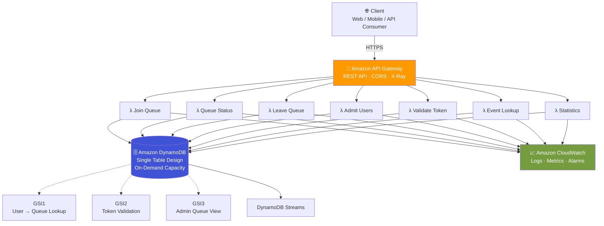
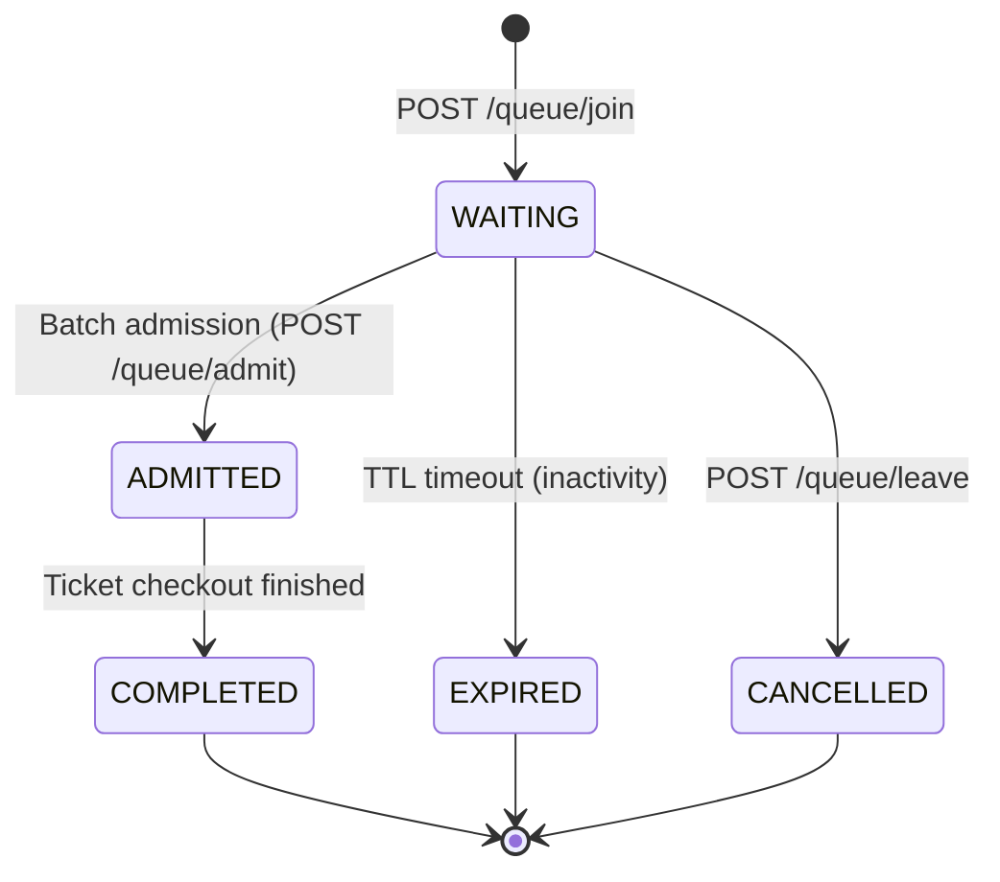

<div align="center">

# 🏟️ Football Virtual Waiting Room

### A serverless, DynamoDB-powered queue system built to survive a Manchester United vs. Liverpool ticket drop

*AWS Builder Center — DynamoDB Data Modeling Challenge*


[Overview](#-overview) •
[Architecture](#-architecture) •
[Data Model](#-data-model) •
[API](#-api-reference) •
[Getting Started](#-getting-started) •
[Testing](#-testing) •
[Docs](#-full-documentation) •
[Roadmap](#-roadmap)

</div>

---

## 📖 Overview

When tickets go live for a high-demand football match, millions of fans hit "refresh" at the same moment. Without traffic control, that surge crashes backend services, oversells tickets, and ruins the experience for everyone.

**This project is a production-inspired implementation of the virtual waiting room pattern** — instead of every request hitting the ticketing service directly, users join a fair, ordered queue and are admitted in controlled batches.

It was built for the **AWS Builder Center DynamoDB Data Modeling Challenge**, so while the system is fully functional, the real point of the project is the *data modeling*: proving that a single, well-designed DynamoDB table — with the right keys, indexes, and TTLs — can support millions of concurrent users with no table scans, no hot partitions, and predictable low-latency reads.

<table>
<tr>
<td width="50%" valign="top">

**What it does**
- 🎟️ Registers users into a per-event queue
- 📍 Tracks live queue position & wait estimate
- ✅ Admits users fairly, in ordered batches
- 🔑 Issues short-lived admission tokens
- ⏳ Auto-expires idle sessions & tokens (TTL)
- 📊 Serves real-time queue statistics

</td>
<td width="50%" valign="top">

**What it proves**
- Access-pattern-first DynamoDB design
- Single Table Design at scale
- Query-only, scan-free data access
- Serverless cost efficiency
- Infrastructure as Code (AWS SAM)
- Production-grade test coverage

</td>
</tr>
</table>

---

## 🏗️ Architecture

Fully serverless — no servers to patch, no capacity to pre-provision.



Every Lambda function is single-purpose, stateless, and shares one common library (`src/common/`) for logging, DynamoDB access, response formatting, and models — so the same conventions apply everywhere.

### The queue lifecycle



> 💡 **Design decision:** queue positions are assigned once and never rewritten. Instead of shuffling everyone forward when a user cancels, only `status` changes — this keeps write volume flat even at millions of queue entries. See [`docs/05-table-schema.md`](docs/05-table-schema.md) for the full reasoning.

---

## 🗃️ Data Model

The entire application lives in **one DynamoDB table** (`FootballWaitingRoom`), storing six logical entity types differentiated by key prefixes — the classic Single Table Design pattern.

<details>
<summary><b>Show entity key schema</b></summary>

| Entity | PK | SK | Purpose |
|---|---|---|---|
| Event | `EVENT#<id>` | `METADATA` | Match metadata (stadium, capacity, status) |
| Queue Entry | `EVENT#<id>` | `QUEUE#<position>` | A user's place in an event's queue |
| User | `USER#<id>` | `PROFILE` | Customer profile |
| Session | `USER#<id>` | `SESSION#ACTIVE` | Active waiting-room session (TTL) |
| Admission Token | `TOKEN#<id>` | `METADATA` | Short-lived checkout token (TTL) |
| Statistics | `EVENT#<id>` | `STATS` | Aggregate counters, updated atomically |

</details>

<details>
<summary><b>Show example items</b></summary>

```json
// Event
{ "PK": "EVENT#1001", "SK": "METADATA", "entityType": "EVENT",
  "matchName": "Manchester United vs Liverpool", "capacity": 50000, "status": "OPEN" }

// Queue Entry
{ "PK": "EVENT#1001", "SK": "QUEUE#00000123", "entityType": "QUEUE",
  "userId": "501", "queuePosition": 123, "status": "WAITING",
  "joinTime": "2026-07-08T12:00:00Z" }

// Admission Token (TTL-managed)
{ "PK": "TOKEN#ABC123", "SK": "METADATA", "entityType": "TOKEN",
  "userId": "501", "status": "ACTIVE", "expiresAt": 1783525200, "ttl": 1783525200 }
```

</details>

### Global Secondary Indexes — kept deliberately minimal

Every extra GSI adds write cost and storage overhead, so each one here exists to satisfy a *specific, real* access pattern — not "just in case."

| Index | Key | Serves |
|---|---|---|
| **GSI1** | `USER#<id>` → `EVENT#<id>` | "What's my queue status?" / resume session |
| **GSI2** | `TOKEN#<id>` | Fast admission-token validation before checkout |
| **GSI3** *(optional)* | `EVENT#<id>` → `STATUS#<state>` | Admin dashboards & monitoring (not customer-facing) |

Full rationale in [`docs/06-index-design.md`](docs/06-index-design.md). Access-pattern derivation in [`docs/03-access-patterns.md`](docs/03-access-patterns.md).

---

## 🔌 API Reference

Base URL: `https://api.example.com/v1`

| Method | Endpoint | Description | DynamoDB Op |
|---|---|---|---|
| `POST` | `/queue/join` | Join the waiting room for an event | Conditional `PutItem` |
| `GET` | `/queue/status` | Get live position & estimated wait | `Query` (GSI1) |
| `POST` | `/queue/leave` | Voluntarily leave the queue | `UpdateItem` |
| `POST` | `/queue/admit` | *(Admin)* Admit the next batch of users | `Query` + batched `UpdateItem` |
| `POST` | `/token/validate` | Validate an admission token before checkout | `GetItem` (GSI2) |
| `GET` | `/event/{eventId}` | Fetch match metadata | `GetItem` |
| `GET` | `/event/{eventId}/stats` | Real-time queue statistics | `GetItem` |

<details>
<summary><b>Example — join the queue</b></summary>

```http
POST /queue/join
Content-Type: application/json

{ "eventId": "1001", "userId": "501" }
```

```json
HTTP 201 Created
{
  "message": "Successfully joined queue.",
  "queuePosition": 123,
  "status": "WAITING",
  "estimatedWaitMinutes": 18
}
```

</details>

<details>
<summary><b>Example — validate an admission token</b></summary>

```http
POST /token/validate
Content-Type: application/json

{ "token": "ABC123XYZ" }
```

```json
HTTP 200 OK
{ "valid": true, "eventId": "1001", "userId": "501", "expiresAt": "2026-07-08T13:45:00Z" }
```

</details>

Full endpoint contracts, validation rules, rate-limit recommendations, and error schemas: [`docs/08-api-design.md`](docs/08-api-design.md).
A ready-to-import request collection lives in [`postman/`](postman/).

---

## 🧰 Technology Stack

| Layer | Services / Tools |
|---|---|
| **Compute** | AWS Lambda (Python 3.12) |
| **Data** | Amazon DynamoDB (Single Table, On-Demand, Streams, TTL) |
| **API** | Amazon API Gateway (REST) |
| **Observability** | Amazon CloudWatch, structured JSON logging (AWS Lambda Powertools) |
| **Security** | AWS IAM (least privilege) |
| **Infrastructure as Code** | AWS SAM / CloudFormation |
| **App dependencies** | `boto3`, `aws-lambda-powertools`, `pydantic` |
| **Dev & QA** | `pytest`, `moto`, `black`, `flake8`, `mypy`, `isort`, `pre-commit` |
| **Load testing** | k6 / Artillery / Locust |
| **CI/CD** | GitHub Actions |

---

## 📁 Repository Structure

```
football-virtual-waiting-room/
├── .github/workflows/      # CI pipeline (test + sam validate)
├── docs/                   # 15-part design & engineering log (see below)
├── diagrams/               # Detailed architecture diagrams
├── src/
│   ├── common/              # Shared: dynamodb, models, responses, logger, utils
│   ├── join_queue/
│   ├── queue_status/
│   ├── leave_queue/
│   ├── admit_users/
│   ├── validate_token/
│   ├── event_lookup/
│   └── statistics/          # One Lambda handler per folder
├── tests/
│   ├── unit/
│   ├── integration/
│   ├── api/
│   └── load/
├── events/                  # Sample Lambda test events (SAM local)
├── scripts/                 # seed_data.py, generate_test_data.py
├── postman/                  # API collection + environment
├── template.yaml             # AWS SAM infrastructure definition
└── samconfig.toml
```

---

## 🚀 Getting Started

### Prerequisites

- Python 3.12+
- [AWS SAM CLI](https://docs.aws.amazon.com/serverless-application-model/latest/developerguide/install-sam-cli.html)
- An AWS account with configured credentials (`aws configure`)

### 1. Clone & install

```bash
git clone https://github.com/Afffan16/football-virtual-waiting-room.git
cd football-virtual-waiting-room
pip install -r requirements-dev.txt   # installs app + dev dependencies
```

### 2. Run it locally

```bash
sam build
sam local start-api
```

### 3. Deploy to AWS

```bash
sam deploy --guided
```

This provisions the `FootballWaitingRoom` DynamoDB table (with GSI1–GSI3, Streams, and TTL), all seven Lambda functions, and the API Gateway REST API — entirely via CloudFormation.

### 4. Seed some data (optional)

```bash
python scripts/seed_data.py
python scripts/generate_test_data.py
```

> All of the above are also available as `make` targets — see the [Makefile](Makefile) (`make install`, `make build`, `make deploy`, `make local`, `make test`).

---

## 🧪 Testing

```bash
pytest                 # full suite
pytest --cov=src       # with coverage
make lint               # flake8
make format             # black
```

The suite spans four layers, from isolated Lambda logic up to simulated production load:

| Layer | What it covers |
|---|---|
| **Unit** (`tests/unit`) | Lambda handler logic, response formatting, models, validation |
| **Integration** (`tests/integration`) | End-to-end flow through API Gateway → Lambda → DynamoDB, per endpoint |
| **API** (`tests/api`) | Contract testing against the documented request/response schemas |
| **Load** (`tests/load`) | Concurrent-user and burst-traffic simulation |

Performance targets (validated under load): API responses **< 200 ms**, token validation **< 100 ms**, error rate **< 1%**. Full plan: [`docs/11-testing-plan.md`](docs/11-testing-plan.md) · Load test design: [`docs/12-load-testing.md`](docs/12-load-testing.md).

---

## 💰 Why serverless, cost-wise

DynamoDB runs in **On-Demand** mode — no capacity planning, scales automatically for a ticket-drop spike, and costs nothing when idle. TTL removes expired sessions and tokens without a single cron job. Combined with Lambda's pay-per-invocation model, the whole stack has **zero always-on cost** between events.

| Architecture | Relative Cost | Ops Overhead |
|---|---|---|
| Traditional servers | High | High |
| Containers | Medium | Medium |
| **This solution (serverless)** | **Low–Medium** | **Low** |

Full breakdown, sample workload assumptions, and optimization techniques: [`docs/13-cost-estimation.md`](docs/13-cost-estimation.md).

---

## 📚 Full Documentation

Every design decision in this project — not just the code — is documented. This was written as an engineering log for the AWS Builder Center challenge, so it doubles as a walkthrough of *how* to reason through a DynamoDB data model from scratch.

| # | Document | What's inside |
|---|---|---|
| 00 | [Project Status](docs/00-project-status.md) | Roadmap & implementation phases |
| 01 | [Challenge Details](docs/01-challenge-details.md) | The original problem brief |
| 02 | [Requirements Analysis](docs/02-requirements-analysis.md) | Functional & non-functional requirements |
| 03 | [Access Patterns](docs/03-access-patterns.md) | Every query the app needs to serve |
| 04 | [Data Model](docs/04-data-model.md) | Logical entities & relationships |
| 05 | [Table Schema](docs/05-table-schema.md) | Physical PK/SK design |
| 06 | [Index Design](docs/06-index-design.md) | GSI1–GSI3 rationale |
| 07 | [System Architecture](docs/07-system-architecture.md) | Full AWS architecture |
| 08 | [API Design](docs/08-api-design.md) | REST contract, errors, rate limits |
| 09 | [Implementation Plan](docs/09-implementation-plan.md) | Build order & milestones |
| 10 | [Step-by-Step Build](docs/10-step-by-step-build.md) | How it was actually built |
| 11 | [Testing Plan](docs/11-testing-plan.md) | Test strategy & acceptance criteria |
| 12 | [Load Testing](docs/12-load-testing.md) | Traffic simulation design |
| 13 | [Cost Estimation](docs/13-cost-estimation.md) | Pricing model & optimization |
| 14 | [Optimization](docs/14-optimization.md) | Performance tuning notes |
| 15 | [Final Solution](docs/15-final-solution.md) | Executive summary |

Extra detailed diagrams (component-level, sequence flows): [`diagrams/architecture-diagrams.md`](diagrams/architecture-diagrams.md).

---

## 🗺️ Roadmap

- [ ] Push-based queue updates via WebSocket / SSE (replace polling)
- [ ] Multi-region deployment with DynamoDB Global Tables
- [ ] Write sharding for extreme-scale events (`EVENT#id#SHARD#n`)
- [ ] Redis/ElastiCache layer for hot read paths
- [ ] CI/CD pipeline with automated deployment gates
- [ ] Real-time analytics dashboard

---

## 🤝 Contributing

Contributions are welcome — fork, branch, write tests, and open a PR. Coding standards, workflow, and infrastructure rules are in [`CONTRIBUTING.MD`](CONTRIBUTING.MD).

## 📄 License

Released under the [MIT License](LICENSE) — provided for educational and demonstration purposes.

---

<div align="center">

**Muhammad Affan bin Aamir**
Junior Data Engineer · AWS Builder Community Member

[](https://github.com/Afffan16)

</div>
