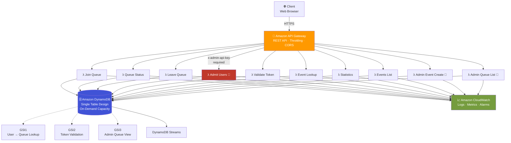
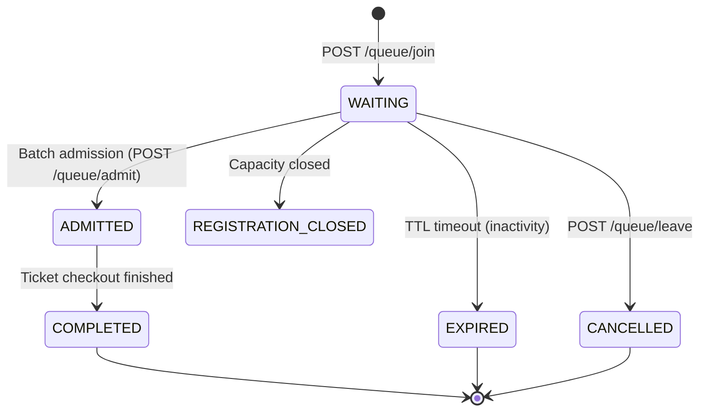

<div align="center">

# 🏟️ Football Virtual Waiting Room

### A serverless, DynamoDB-powered queue system built to survive a viral football match ticket drop

*AWS Builder Center — DynamoDB Data Modeling Challenge*


[Overview](#-overview) •
[Architecture](#-architecture) •
[Data Model](#%EF%B8%8F-data-model) •
[Workbench Model](nosql-workbench/football-waiting-room-data-model.json) •
[API](#-api-reference) •
[Getting Started](#-getting-started) •
[Deployment](#-deployment) •
[Testing](#-testing) •
[Docs](#-full-documentation)

<br>

[](https://ddwi3zvh6b39d.cloudfront.net/)
[](http://football-waiting-room-affan.s3-website-us-east-1.amazonaws.com/)

*Admin portal login → `admin123@gmail.com` / `admin123`*

</div>

---

## 📖 Overview

When tickets go live for a high-demand football match, millions of fans hit "refresh" at the same moment. Without traffic control, that surge crashes backend services, oversells tickets, and ruins the experience for everyone.

**This project is a production-inspired implementation of the virtual waiting room pattern** — instead of every request hitting the ticketing service directly, users join a fair, ordered queue and are admitted in controlled batches.

It was built for the **AWS Builder Center DynamoDB Data Modeling Challenge**, so while the system is fully functional, the real point of the project is the *data modeling*: proving that a single, well-designed DynamoDB table — with the right keys, indexes, and TTLs — can support millions of concurrent users with no table scans, no hot partitions, and predictable low-latency reads.

<table>
<tr>
<td width="50%" valign="top">

**What it does**
- 🎟️ Registers users into a per-event queue
- 📍 Tracks live queue position & wait estimate
- ✅ Admits users fairly, in ordered batches
- 🔑 Issues short-lived admission tokens
- ⏳ Auto-expires idle sessions & tokens (TTL)
- 📊 Serves real-time queue statistics
- 🗂️ Serves a DynamoDB-backed event catalog
- 🛡️ Admin event, admit, and queue-list endpoints protected by demo admin headers or API key auth

</td>
<td width="50%" valign="top">

**What it proves**
- Access-pattern-first DynamoDB design
- Single Table Design at scale
- Query-only, scan-free data access
- Serverless cost efficiency
- Infrastructure as Code (AWS SAM)
- Security: input validation, admin auth, throttling
- Production-grade test coverage

</td>
</tr>
</table>

---

## 🖥️ Frontend

A glassmorphism dark-themed **Single Page Application** with four views:

| View | Description |
|---|---|
| **Home** | Role selection (Admin / User), live stats bar |
| **Admin Dashboard** | Add-event form, batch admit controls, live queue stats, real queue table with filters, activity log |
| **Events List** | Event grid loaded from DynamoDB, with the seeded catalog as fallback |
| **Event Detail** | Join queue, check status, leave queue — full user workflow |

Files: `frontend/index.html`, `frontend/styles.css`, `frontend/app.js`

> **▶ Try it live:** **[ddwi3zvh6b39d.cloudfront.net](https://ddwi3zvh6b39d.cloudfront.net/)**
> **🔑 Admin login:** `admin123@gmail.com` / `admin123`

To run locally: open `frontend/index.html` in a browser, or serve with `python -m http.server 8080 --directory frontend`.

---

## 🏗️ Architecture

Fully serverless — no servers to patch, no capacity to pre-provision.



Every Lambda function is single-purpose and stateless. The `src/common/` module is shared across all functions for logging, DynamoDB access, response formatting, and data models.

### The queue lifecycle



> 💡 Queue positions are assigned once and never rewritten. Only `status` changes — this keeps write volume flat even at millions of queue entries. See [`docs/05-table-schema.md`](docs/05-table-schema.md) for the full reasoning.

---

## 🗃️ Data Model

The entire application lives in **one DynamoDB table** (`FootballWaitingRoom`), storing six logical entity types differentiated by key prefixes — Single Table Design.

<details>
<summary><b>Show entity key schema</b></summary>

| Entity | PK | SK | Purpose |
|---|---|---|---|
| Event | `EVENT#<id>` | `METADATA` | Match metadata (stadium, capacity, status) |
| Queue Entry | `EVENT#<id>` | `QUEUE#<position>` | A user's place in an event's queue |
| Queue Registration | `USER#<id>` | `QUEUE#EVENT#<eventId>` | Active per-user event guard |
| User | `USER#<id>` | `PROFILE` | Customer profile |
| Session | `USER#<id>` | `SESSION#ACTIVE` | Active waiting-room session (TTL) |
| Admission Token | `TOKEN#<id>` | `METADATA` | Short-lived checkout token (TTL) |
| Statistics | `EVENT#<id>` | `STATS` | Aggregate counters, updated atomically |

</details>

### Global Secondary Indexes

| Index | Key | Serves |
|---|---|---|
| **GSI1** | `USER#<id>` → `EVENT#<id>` | "What's my queue status?" / resume session |
| **GSI2** | `TOKEN#<id>` | Fast admission-token validation before checkout |
| **GSI3** | `EVENT#<id>` → `STATUS#<state>` | Admin dashboards, ordered admission batches |

> 🗺️ **NoSQL Workbench export:** the full data model — table, GSI1–GSI3, and sample items — is available as an importable JSON file at [`nosql-workbench/football-waiting-room-data-model.json`](nosql-workbench/football-waiting-room-data-model.json).

Full rationale in [`docs/06-index-design.md`](docs/06-index-design.md).

---

## 🔌 API Reference

Base URL: `https://n20mxucrj4.execute-api.us-east-1.amazonaws.com/Prod`

| Method | Endpoint | Description | Auth |
|---|---|---|---|
| `POST` | `/queue/join` | Join the waiting room for an event | — |
| `GET` | `/queue/status` | Get live position & estimated wait | — |
| `POST` | `/queue/leave` | Voluntarily leave the queue | — |
| `POST` | `/queue/admit` | *(Admin)* Admit the next batch | Demo admin headers or `x-admin-api-key` |
| `GET` | `/queue/admin/list` | *(Admin)* List real queue entries | Demo admin headers or `x-admin-api-key` |
| `POST` | `/token/validate` | Validate an admission token before checkout | — |
| `GET` | `/events` | List all event metadata | — |
| `GET` | `/event/{eventId}` | Fetch match metadata | — |
| `POST` | `/event` | *(Admin)* Create an event and stats row | Demo admin headers or `x-admin-api-key` |
| `GET` | `/event/{eventId}/stats` | Real-time queue statistics | — |

> 🔐 Admin endpoints accept the demo dashboard headers (`x-admin-email`, `x-admin-password`) and still support `x-admin-api-key` as the production path. Requests without valid admin credentials return `403 Forbidden`.

<details>
<summary><b>Example — join the queue</b></summary>

```http
POST /queue/join
Content-Type: application/json

{ "eventId": "1001", "userId": "FAN-001" }
```

```json
HTTP 201 Created
{
  "message": "Successfully joined queue.",
  "queuePosition": "01783512345678-a1b2c3d4",
  "status": "WAITING",
  "estimatedWaitMinutes": 12
}
```

</details>

<details>
<summary><b>Example — admit a batch (admin)</b></summary>

```http
POST /queue/admit
Content-Type: application/json
x-admin-api-key: your-admin-key

{ "eventId": "1001", "batchSize": 50 }
```

```json
HTTP 200 OK
{
  "admittedUsers": 50,
  "remainingQueue": 18235,
  "admittedUserIds": ["FAN-001", "FAN-002", "..."]
}
```

</details>

Full endpoint contracts, validation rules, and error schemas: [`docs/08-api-design.md`](docs/08-api-design.md).

---

## 🔐 Security

| Measure | Detail |
|---|---|
| Admin endpoint protection | Admin routes accept demo admin headers or `x-admin-api-key` — verified server-side with `hmac.compare_digest` |
| Input validation | All endpoints validate required fields and reject inputs exceeding length limits |
| Batch size cap | `/queue/admit` caps `batchSize` at 500 to limit per-call DynamoDB write cost |
| IAM least privilege | Read-only Lambdas: `DynamoDBReadPolicy`. Write Lambdas: `DynamoDBCrudPolicy`; transaction writers also grant `dynamodb:TransactWriteItems` |
| Throttling | API Gateway stage throttling and usage plan tuned for controlled load tests |
| Encryption | DynamoDB SSE enabled; all traffic over HTTPS |
| Token expiration | Admission tokens enforced at runtime (status + epoch check) |
| Admin credential management | Demo credentials are used by the static dashboard; production should use Cognito, a Lambda Authorizer, or Secrets Manager |

> For a production deployment, move `AdminApiKey` to AWS Secrets Manager and add a Lambda Authorizer or Cognito for user identity. See [`docs/13-deployment-guide.md`](docs/13-deployment-guide.md#production-considerations).

---

## 🧰 Technology Stack

| Layer | Services / Tools |
|---|---|
| **Compute** | AWS Lambda (Python 3.14) |
| **Data** | Amazon DynamoDB (Single Table, On-Demand, Streams, TTL, PITR, SSE) |
| **API** | Amazon API Gateway (REST, throttling, usage plans) |
| **Frontend** | Static HTML/CSS/JS SPA — glassmorphism dark theme, hosted on S3 + CloudFront |
| **Observability** | Amazon CloudWatch, structured JSON logging (AWS Lambda Powertools) |
| **Security** | AWS IAM (least privilege), API key auth, input validation |
| **Infrastructure as Code** | AWS SAM / CloudFormation |
| **Load testing** | `scripts/mass_ticket_requests.py` (asyncio + aiohttp) |
| **Dev & QA** | `pytest`, `moto`, `black`, `flake8`, `mypy`, `isort`, `pre-commit` |

---

## 📁 Repository Structure

```
football-virtual-waiting-room/
├── docs/                   # 13-part design & engineering log
├── diagrams/               # Architecture diagrams
├── frontend/               # Static SPA (index.html, styles.css, app.js)
├── nosql-workbench/        # NoSQL Workbench data model export
├── src/
│   ├── common/             # Shared: dynamodb, models, responses, logger, utils, constants, auth
│   ├── join_queue/
│   ├── queue_status/
│   ├── leave_queue/
│   ├── admit_users/        # 🔐 Admin-protected endpoint
│   ├── validate_token/
│   ├── event_lookup/
│   ├── events/
│   ├── admin_event/
│   ├── admin_queue_list/
│   └── statistics/
├── tests/
│   ├── unit/
│   ├── integration/
│   ├── api/
│   └── load/
├── events/                 # Sample Lambda test events (SAM local)
├── scripts/
│   ├── seed_data.py
│   ├── generate_test_data.py
│   ├── clear_event_records.py
│   └── mass_ticket_requests.py   # 1M-request async load test
├── postman/                # API collection + environment
├── cf-config.json          # CloudFront distribution config
├── template.yaml           # AWS SAM infrastructure definition
└── samconfig.toml
```

---

## 🚀 Getting Started

### Prerequisites

- Python 3.12+
- [AWS SAM CLI](https://docs.aws.amazon.com/serverless-application-model/latest/developerguide/install-sam-cli.html)
- An AWS account with configured credentials (`aws configure`)

### 1. Clone & install

```bash
git clone https://github.com/Afffan16/football-virtual-waiting-room.git
cd football-virtual-waiting-room
pip install -r requirements.txt
```

### 2. Run locally

```bash
sam build
sam local start-api
```

### 3. Deploy to AWS

```bash
# First deploy — guided setup
sam deploy --guided

# You will be prompted for AdminApiKey — generate a strong one:
# openssl rand -hex 32
```

### 4. Seed the database

```bash
python scripts/seed_data.py
```

### 5. Open the frontend

Edit `frontend/app.js` — set `API_BASE` to your deployed API URL. Then open `frontend/index.html` in a browser. The demo admin login is `admin123@gmail.com` / `admin123`.

Or just visit the live deployment: https://ddwi3zvh6b39d.cloudfront.net/

---

## 🚢 Deployment

Full step-by-step guide including S3 + CloudFront frontend deployment, environment configuration, and production considerations: **[`docs/13-deployment-guide.md`](docs/13-deployment-guide.md)**

Quick reference:

```bash
sam build
sam deploy --parameter-overrides AdminApiKey="$(openssl rand -hex 32)"
```

### 🌐 Live Environment

<div align="center">

| Layer | Service | URL |
|:---|:---|:---|
| 🖥️ Frontend | CloudFront *(HTTPS, cached — recommended)* | **[ddwi3zvh6b39d.cloudfront.net](https://ddwi3zvh6b39d.cloudfront.net/)** |
| 🪣 Frontend origin | S3 static website hosting | [football-waiting-room-affan.s3-website-us-east-1.amazonaws.com](http://football-waiting-room-affan.s3-website-us-east-1.amazonaws.com/) |
| ⚙️ Backend | API Gateway (REST) | [n20mxucrj4.execute-api.us-east-1.amazonaws.com/Prod](https://n20mxucrj4.execute-api.us-east-1.amazonaws.com/Prod) |

</div>

### Redeploying frontend changes

After editing files in `frontend/`, sync to S3 and invalidate the CloudFront cache so visitors see the update immediately:

```bash
aws s3 sync ./frontend s3://football-waiting-room-affan --delete
aws cloudfront create-invalidation --distribution-id <YOUR_DISTRIBUTION_ID> --paths "/*"
```

---

## 🧪 Testing

Full testing guide (unit, integration, API contract, load, manual cURL, SAM Local, security checklist): **[`docs/12-testing-guide.md`](docs/12-testing-guide.md)**

Quick reference:

```bash
pytest                        # full suite
pytest --cov=src              # with coverage
pytest tests/unit/            # unit tests only
pytest tests/integration/     # integration tests only
flake8 src tests              # lint
black src tests               # format
```

### Load testing

```bash
pip install aiohttp
python scripts/mass_ticket_requests.py --total 1000 --concurrency 20 --event 1001
```

Performance targets (validated under load): API p99 < 500 ms · error rate < 1% · throughput > 500 req/s sustained.

---

## 💰 Why serverless, cost-wise

DynamoDB runs in **On-Demand** mode — no capacity planning, auto-scales for a ticket-drop spike, costs nothing when idle. TTL removes expired tokens without cron jobs. Lambda is pay-per-invocation.

| Architecture | Relative Cost | Ops Overhead |
|---|---|---|
| Traditional servers | High | High |
| Containers | Medium | Medium |
| **This solution (serverless)** | **Low–Medium** | **Low** |

Full breakdown: [`docs/10-cost-estimation.md`](docs/10-cost-estimation.md).

---

## 📚 Full Documentation

| # | Document | What's inside |
|---|---|---|
| 00 | [Project Status](docs/00-project-status.md) | Roadmap & implementation phases |
| 01 | [Challenge Details](docs/01-challenge-details.md) | The original problem brief |
| 02 | [Requirements Analysis](docs/02-requirements-analysis.md) | Functional & non-functional requirements |
| 03 | [Access Patterns](docs/03-access-patterns.md) | Every query the app needs to serve |
| 04 | [Data Model](docs/04-data-model.md) | Logical entities & relationships |
| 05 | [Table Schema](docs/05-table-schema.md) | Physical PK/SK design |
| 06 | [Index Design](docs/06-index-design.md) | GSI1–GSI3 rationale |
| 07 | [System Architecture](docs/07-system-architecture.md) | Full AWS architecture |
| 08 | [API Design](docs/08-api-design.md) | REST contract, errors, rate limits, security |
| 09 | [Build Guide](docs/09-build-guide.md) | Plan, build retrospective, Phase 6 detail |
| 10 | [Cost Estimation](docs/10-cost-estimation.md) | Pricing model & optimization |
| 11 | [Optimization](docs/11-optimization.md) | Performance tuning notes |
| **12** | **[Testing Guide](docs/12-testing-guide.md)** | **Complete how-to testing reference** |
| **13** | **[Deployment Guide](docs/13-deployment-guide.md)** | **End-to-end deployment + S3/CloudFront** |

---

## 🗺️ Roadmap

- [ ] Push-based queue updates via WebSocket / SSE (replace polling)
- [ ] Multi-region deployment with DynamoDB Global Tables
- [ ] Write sharding for extreme-scale events (`EVENT#id#SHARD#n`)
- [ ] Lambda Authorizer / Cognito for verified user identity
- [ ] Move admin key to AWS Secrets Manager
- [ ] Redis/ElastiCache layer for hot read paths
- [ ] Real-time analytics dashboard

---

## 🤝 Contributing

Fork, branch, write tests, and open a PR. See [`CONTRIBUTING.MD`](CONTRIBUTING.MD) for coding standards and the PR checklist.

## 📋 Challenge Deliverables

Full breakdown of every challenge requirement and how it was met: **[`DELIVERABLES.md`](DELIVERABLES.md)**

## 📄 License

Released under the [MIT License](LICENSE).

---

<div align="center">

**Muhammad Affan bin Aamir**
Software Engineer · Cloud Data Engineer · AWS Student Builder Group Leader

[](https://github.com/Afffan16)

</div>
