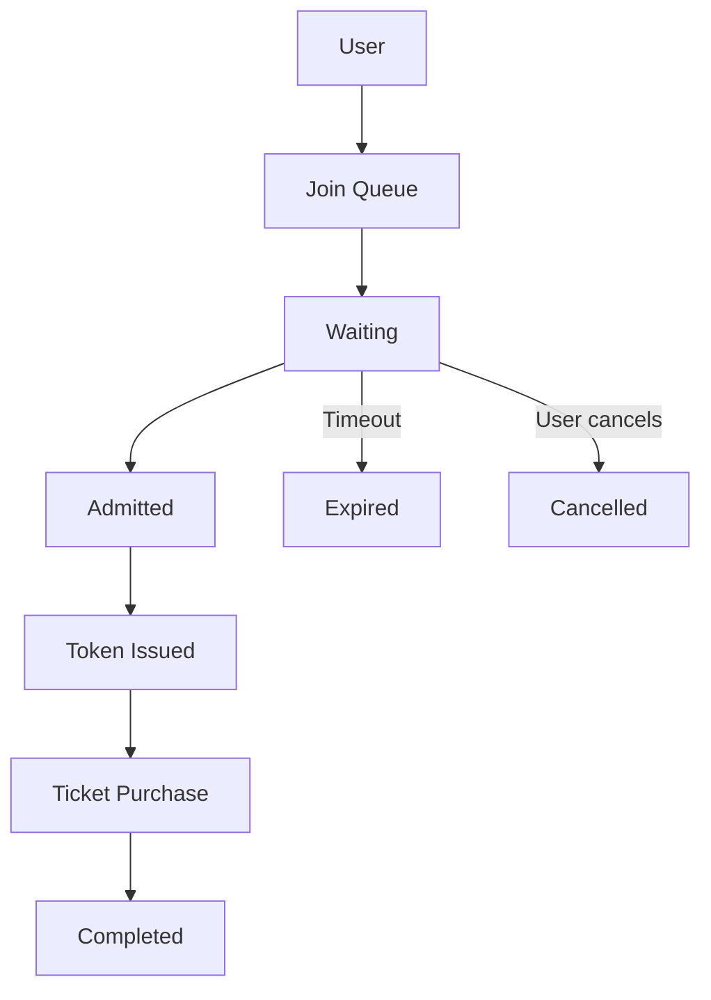

# 📋 Requirements Analysis

**Author:** Muhammad Affan bin Aamir · **Version:** 1.0 · **Document:** `docs/02-requirements-analysis.md`

← [Back: Challenge Details](01-challenge-details.md) · Next: [Access Patterns →](03-access-patterns.md)

---

## Table of Contents

- [Purpose](#purpose)
- [Business Problem](#business-problem)
- [Core Business Goals](#core-business-goals)
- [Functional Requirements](#functional-requirements)
- [Non-Functional Requirements](#non-functional-requirements)
- [Data Entities](#data-entities)
- [Data Lifecycle](#data-lifecycle)
- [DynamoDB Design Principles](#dynamodb-design-principles)
- [Risks](#risks)
- [Key Technical Decisions](#key-technical-decisions)
- [Outputs of This Analysis](#outputs-of-this-analysis)

---

## Purpose

This document translates the business requirements of the Football Virtual Waiting Room (see [`01-challenge-details.md`](01-challenge-details.md)) into technical requirements that guide the DynamoDB data model.

Unlike relational databases, Amazon DynamoDB is designed using an **access-pattern-first approach**. Understanding *how* the application interacts with the data is essential before defining partition keys, sort keys, or indexes — that derivation happens next, in [`03-access-patterns.md`](03-access-patterns.md).

---

## Business Problem

When tickets for a popular football match are released, millions of users may attempt to access the ticketing platform simultaneously. Without proper request management:

- Backend systems become overloaded.
- Ticket inventory may become inconsistent.
- Users experience long wait times.
- Fairness cannot be guaranteed.

The Virtual Waiting Room acts as a buffer between users and the ticketing platform, controlling admission based on queue order and system capacity.

---

## Core Business Goals

The solution should:

- Handle sudden traffic spikes
- Protect backend ticketing systems
- Ensure fairness in queue processing
- Scale to millions of concurrent users
- Provide users with real-time queue updates
- Automatically clean up expired sessions
- Minimize infrastructure costs

---

## Functional Requirements

Each requirement below is written with its DynamoDB implications up front, since that's what ultimately drives the schema in later documents.

### FR-01 — Register a User

A user should be able to join the waiting room for a specific football event.

| | |
|---|---|
| **Inputs** | User ID, Event ID, Timestamp |
| **Expected Outcome** | Queue record created · queue position assigned · user receives confirmation |
| **DynamoDB Implications** | Fast write · no duplicate queue entries · conditional writes to prevent duplicate registration |

### FR-02 — Retrieve Queue Status

Users should be able to check their current queue status.

| | |
|---|---|
| **Returns** | Queue position, queue status, estimated waiting time, event information |
| **DynamoDB Implications** | Query by User ID · no table scans · low-latency reads |

### FR-03 — Admit Users

The system periodically admits users from the front of the queue.

| | |
|---|---|
| **Expected Behavior** | Users admitted in order · queue fairness maintained · admission capacity configurable |
| **DynamoDB Implications** | Efficient retrieval of the next eligible users · ordered queries · minimal read cost |

### FR-04 — Generate Admission Token

When a user is admitted, generate a temporary access token, associate it with the user, and define an expiration time.

| | |
|---|---|
| **DynamoDB Implications** | Fast writes · TTL support · token lookup |

### FR-05 — Validate Token

Before accessing ticket purchasing services, validate the token, ensure it's active, and reject expired tokens.

| | |
|---|---|
| **DynamoDB Implications** | Query by Token ID · very low latency · no scans |

### FR-06 — Remove Expired Users

Inactive users should automatically leave the queue.

| | |
|---|---|
| **Expected Behavior** | Expired records disappear automatically · no scheduled cleanup jobs |
| **DynamoDB Implications** | DynamoDB TTL · automatic expiration |

### FR-07 — Support Multiple Events

The platform must support multiple football matches simultaneously.

| | |
|---|---|
| **Expected Behavior** | Independent queues · independent capacities · independent admission rates |
| **DynamoDB Implications** | Event-aware partitioning · prevent cross-event interference |

---

## Non-Functional Requirements

| Requirement | Target | Technical Requirement |
|---|---|---|
| **Scalability** | Millions of concurrent users | Horizontal scaling · partition distribution · adaptive capacity |
| **Availability** | 99.99% | Fully managed infrastructure · multi-AZ storage · no single point of failure |
| **Performance** | Single-digit millisecond latency | Query operations only · avoid scans · efficient indexing |
| **Cost Efficiency** | Lowest possible read/write cost | Minimal GSIs · projection optimization · sparse indexes where appropriate |
| **Security** | Secure API access | IAM authentication · API authorization · encryption at rest |

---

## Data Entities

The solution revolves around five primary entities — these become the item types in the single-table design ([`04-data-model.md`](04-data-model.md)).

| Entity | Represents | Example Attributes |
|---|---|---|
| **Event** | A football match | Event ID, Stadium, Match Name, Capacity, Start Time |
| **User** | A customer entering the waiting room | User ID, Name, Email, Registration Time |
| **Queue Entry** | A user's position within an event queue | Queue Position, Status, Join Time, Admission Time |
| **Admission Token** | Temporary credential issued on admission | Token ID, Expiration Time, Status |
| **Session** | An active waiting-room session | Session ID, Last Activity, Device Information, Expiration |

---

## Data Lifecycle

---

## DynamoDB Design Principles

These principles guide every schema decision made in the documents that follow:

| Principle | Summary |
|---|---|
| **Single Table Design** | Store all related entities in one table whenever practical |
| **Access Pattern Driven** | Schema satisfies application queries, not relational normalization |
| **Query over Scan** | Every operation uses `Query` or `GetItem` — never a table scan |
| **Immutable Queue Position** | Positions are never rewritten; status transitions track progress instead |
| **Time To Live (TTL)** | Expired sessions and tokens are removed automatically |
| **Conditional Writes** | Prevent duplicate registrations and race conditions during admission |
| **Minimal GSIs** | Indexes exist only when required by a supported access pattern |

---

## Risks

| Risk | Mitigation |
|---|---|
| Hot partitions | Distribute partition keys where appropriate (see sharding strategy in [`04-data-model.md`](04-data-model.md)) |
| Duplicate registrations | Conditional writes |
| Token replay | Token expiration and validation |
| Queue starvation | Ordered admission logic |
| Expensive queries | Access-pattern-driven schema |

---

## Key Technical Decisions

| Decision | Reason |
|---|---|
| Single-table design | Reduced complexity and lower cost |
| TTL enabled | Automatic cleanup, no cron jobs |
| Conditional writes | Data consistency |
| Query-first modeling | High performance |
| Event-based partitioning | Independent queues per match |
| GSIs only where required | Cost optimization |

---

## Outputs of This Analysis

This requirements analysis feeds directly into:

| Next Document | Covers |
|---|---|
| [`03-access-patterns.md`](03-access-patterns.md) | Every query the application needs to serve |
| [`04-data-model.md`](04-data-model.md) | DynamoDB Single Table Design |
| [`05-table-schema.md`](05-table-schema.md) | Primary Key Strategy |
| [`06-index-design.md`](06-index-design.md) | Global Secondary Index Design |
| [`08-api-design.md`](08-api-design.md) | REST API Design |
| `template.yaml` | Infrastructure Implementation |