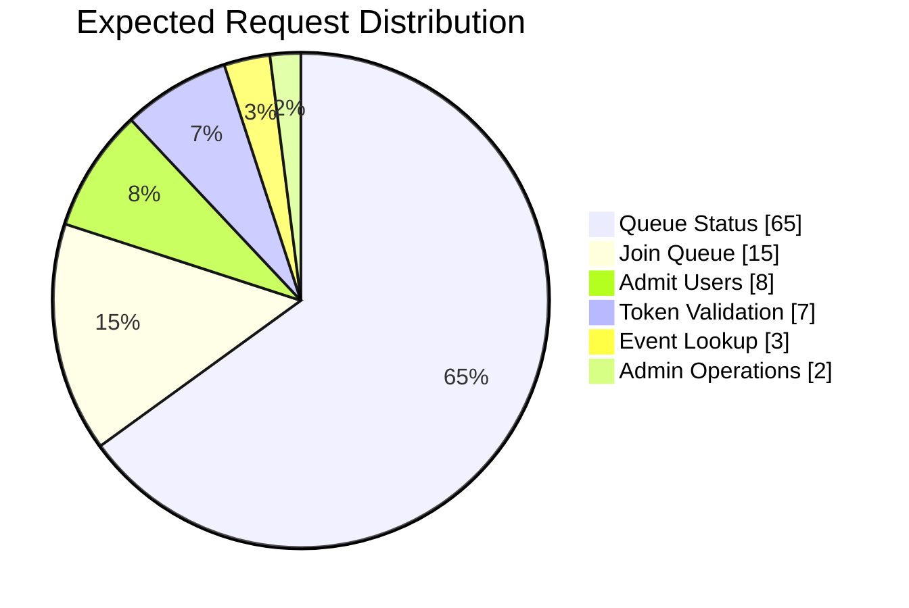

# 🎯 Access Pattern Analysis

**Author:** Muhammad Affan bin Aamir · **Version:** 1.0 · **Document:** `docs/03-access-patterns.md`

← [Back: Requirements Analysis](02-requirements-analysis.md) · Next: [Data Model →](04-data-model.md)

---

## Table of Contents

- [Purpose](#purpose)
- [Design Goals](#design-goals)
- [Core Access Patterns](#core-access-patterns)
- [Access Pattern Details (AP-01 → AP-10)](#access-pattern-details)
- [Read vs. Write Analysis](#read-vs-write-analysis)
- [Expected Request Distribution](#expected-request-distribution)
- [Access Pattern Matrix](#access-pattern-matrix)
- [Access Pattern Priority](#access-pattern-priority)
- [Scalability Considerations](#scalability-considerations)
- [Design Decisions Derived from This Analysis](#design-decisions-derived-from-this-analysis)

---

## Purpose

Amazon DynamoDB is designed around **access patterns**, not entity relationships.

Unlike relational databases — where tables are created first and queries are written later — DynamoDB requires every application query to be identified *before* the table schema is designed. This document defines every operation the Football Virtual Waiting Room must support, and maps each one to an efficient DynamoDB access strategy.

> This is the pivot point of the whole design process: [`02-requirements-analysis.md`](02-requirements-analysis.md) established *what* the system needs to do; this document nails down exactly *how* each of those needs gets queried, which then directly drives the key schema in [`05-table-schema.md`](05-table-schema.md) and the indexes in [`06-index-design.md`](06-index-design.md).

---

## Design Goals

Every access pattern in this document is held to the same bar:

- ✅ Query-based retrieval only
- ✅ No table scans
- ✅ Single-digit millisecond latency
- ✅ Horizontal scalability
- ✅ Minimal read and write costs
- ✅ Efficient partition utilization

---

## Core Access Patterns

| ID | Operation | Priority |
|---|---|---|
| AP-01 | Join Queue | 🔴 High |
| AP-02 | Check Queue Status | 🔴 High |
| AP-03 | Get Event Information | 🔴 High |
| AP-04 | Admit Next Users | 🔴 High |
| AP-05 | Generate Admission Token | 🔴 High |
| AP-06 | Validate Token | 🔴 High |
| AP-07 | Remove Expired Session | 🟡 Medium |
| AP-08 | Update Queue Status | 🟡 Medium |
| AP-09 | List Users for Event (Admin) | 🟢 Low |
| AP-10 | View Queue Statistics | 🟢 Low |
| AP-11 | List Events | 🟢 Low |
| AP-12 | Create Event (Admin) | 🟢 Low |

---

## Access Pattern Details

### AP-01 — Join Queue

A user joins the waiting room for a football event.

| | |
|---|---|
| **Input** | User ID, Event ID, Join Timestamp |
| **Output** | Queue Position, Queue Status |
| **DynamoDB Operation** | `TransactWriteItems` |
| **Conditional Expression** | `attribute_not_exists(PK) AND attribute_not_exists(SK)` on the guard and queue row |
| **Requirements** | Prevent duplicate registrations · assign queue metadata · complete in milliseconds |
| **Expected Cost** | 2 transactional writes plus sharded stats increment |

### AP-02 — Check Queue Status

Retrieve a user's current waiting status.

| | |
|---|---|
| **Input** | User ID, Event ID |
| **Output** | Position, Status, Estimated Wait, Event |
| **DynamoDB Operation** | `GetItem` registration guard → `GetItem` queue row |
| **Requirements** | No scans · returns exactly one queue record |
| **Frequency** | 🔥 Very High — users may poll every few seconds |

### AP-03 — Retrieve Event Details

Retrieve football match information.

| | |
|---|---|
| **Input** | Event ID |
| **Output** | Match, Stadium, Capacity, Queue Status |
| **DynamoDB Operation** | `GetItem` |
| **Frequency** | Medium |

### AP-04 — Admit Next Users

Select the next group of users eligible for admission.

| | |
|---|---|
| **Input** | Event ID, Batch Size |
| **Output** | Users to admit |
| **DynamoDB Operation** | `Query`, ordered by queue metadata |
| **Requirements** | Maintain fairness · avoid scans · support configurable batch sizes |
| **Expected Cost** | Small query returning only the required items |

### AP-05 — Generate Admission Token

Create an access token after admission.

| | |
|---|---|
| **Input** | User ID, Event ID, Expiration |
| **Output** | Token |
| **DynamoDB Operation** | `PutItem` |
| **Requirements** | TTL enabled · token uniqueness enforced |

### AP-06 — Validate Token

Validate a user's admission token before checkout.

| | |
|---|---|
| **Input** | Token |
| **Output** | `Valid` / `Expired` / `Invalid` |
| **DynamoDB Operation** | `GetItem`, or `Query` via GSI |
| **Requirements** | Very low latency |

### AP-07 — Remove Expired Session

Automatically remove inactive sessions.

| | |
|---|---|
| **Input** | TTL Expiration |
| **DynamoDB Operation** | Automatic TTL deletion |
| **Manual Reads** | None |

### AP-08 — Update Queue Status

Update a user's queue status: `WAITING` · `ADMITTED` · `EXPIRED` · `COMPLETED` · `CANCELLED`.

| | |
|---|---|
| **DynamoDB Operation** | `UpdateItem` |
| **Requirements** | Atomic update |

### AP-09 — Administrator View

List users participating in an event.

| | |
|---|---|
| **Input** | Event ID |
| **Output** | User List |
| **DynamoDB Operation** | `Query` |
| **Usage** | Low frequency — administrative dashboard only |

### AP-10 — Queue Statistics

Retrieve queue metrics: current queue size, users admitted, users waiting, expired sessions, completion rate.

| | |
|---|---|
| **DynamoDB Operation** | Aggregated counters / derived metrics — never a scan |

### AP-11 — List Events

Return the event catalog used by the frontend.

| | |
|---|---|
| **Input** | None |
| **Output** | Event metadata list |
| **DynamoDB Operation** | Filtered `Scan` over event metadata |
| **Usage** | Low-frequency catalog load; the old hardcoded catalog remains a frontend fallback |

### AP-12 — Create Event

Admin creates a new football event and its initial statistics row.

| | |
|---|---|
| **Input** | Event ID, match name, stadium, capacity, start time, status |
| **Output** | Created event metadata |
| **DynamoDB Operation** | `TransactWriteItems` |
| **Requirements** | Event metadata and stats row must be created atomically |

---

## Read vs. Write Analysis

| Operation | Read | Write |
|---|:---:|:---:|
| Join Queue | | ✓ |
| Queue Status | ✓ | |
| Event Lookup | ✓ | |
| Admit Users | ✓ | ✓ |
| Token Generation | | ✓ |
| Token Validation | ✓ | |
| Session Expiration | | Automatic (TTL) |
| Status Update | | ✓ |

---

## Expected Request Distribution

**Observation:** the workload is heavily read-oriented, because users continuously poll their queue status. This single fact is the main justification for GSI1 (user → queue lookup) in [`06-index-design.md`](06-index-design.md) — status checks have to be cheap, since they dominate traffic.

---

## Access Pattern Matrix

| Access Pattern | DynamoDB Operation | Expected Result |
|---|---|---|
| Join Queue | `TransactWriteItems` | Guard and queue row created |
| Check Queue | `GetItem` x2 | Single active queue record |
| Event Lookup | `GetItem` | Event metadata |
| Admit Users | `Query` | Ordered batch |
| Issue Token | `PutItem` | Token created |
| Validate Token | `GetItem` | Token status |
| Update Status | `UpdateItem` | Status changed |
| Remove Session | TTL | Record deleted |
| Admin Event View | `Query` | Event users |
| Queue Metrics | `Query` / Counters | Statistics |
| List Events | `Scan` (event metadata only) | Event catalog |
| Create Event | `TransactWriteItems` | Event + stats created |

---

## Access Pattern Priority

| Tier | Patterns | Why |
|---|---|---|
| 🔴 **Critical** | Join Queue · Check Queue · Admit Users · Validate Token | Directly affect end-user experience; must remain highly optimized |
| 🟡 **Important** | Update Queue Status · Token Generation · Event Lookup | Support the critical path but aren't user-facing latency bottlenecks |
| 🟢 **Administrative** | Statistics · Event Dashboard · Queue Reports | Must never impact customer-facing traffic |

---

## Scalability Considerations

| Challenge | Mitigation |
|---|---|
| **Hot partitions** — millions of users may join the same event simultaneously | Event-based partitioning · write sharding if necessary · adaptive capacity |
| **Polling traffic** — users repeatedly check queue status | Query by User ID · lightweight projections · efficient indexing |
| **Admission processing** — users must be admitted in order | Sort key ordering · `Query` with `Limit` · batch updates |
| **Token validation** — must remain extremely fast | Direct key lookup · dedicated GSI if required |

---

## Design Decisions Derived from This Analysis

From this analysis, the final DynamoDB model must support:

- Fast user lookup
- Fast event lookup
- Ordered queue traversal
- Token lookup
- Automatic expiration
- Atomic updates
- Conditional writes
- Transactional writes for multi-item invariants
- Efficient indexing

These requirements directly shape the Partition Key, Sort Key, and GSI design in the next two documents: [`04-data-model.md`](04-data-model.md) and [`05-table-schema.md`](05-table-schema.md).
