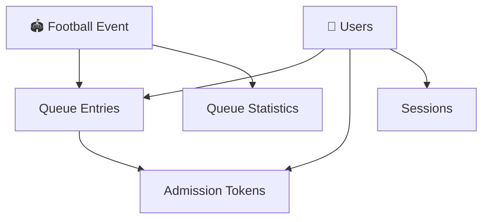
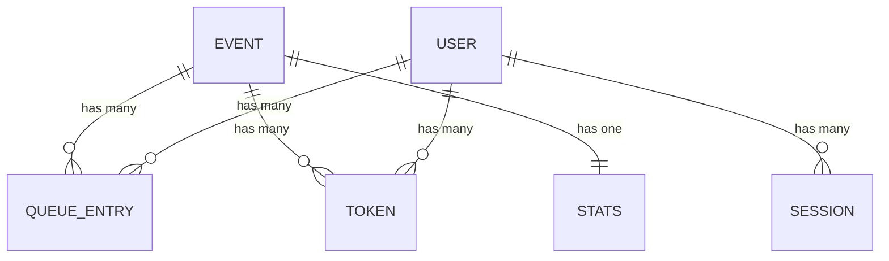
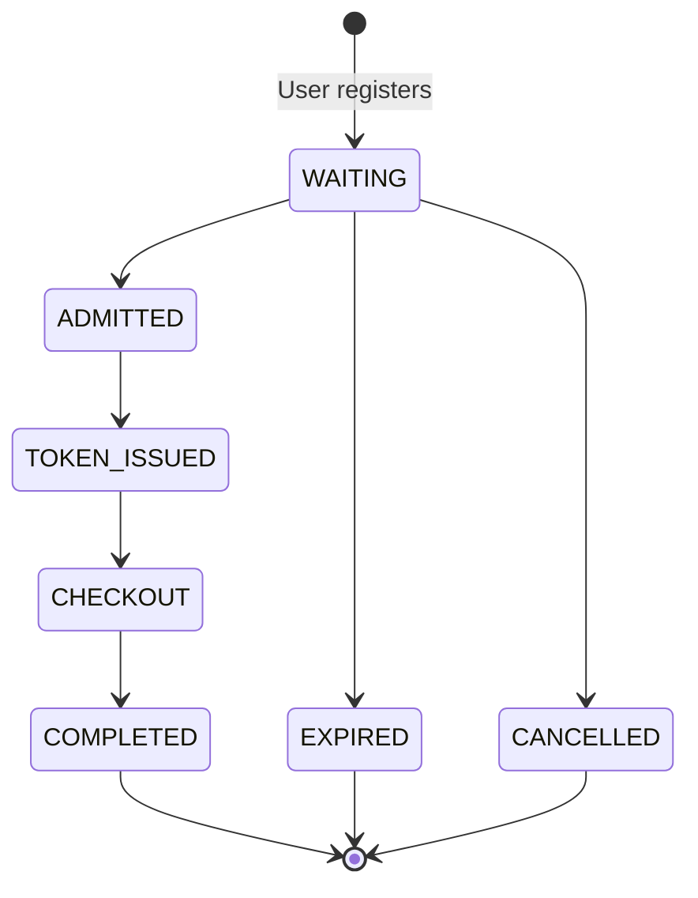
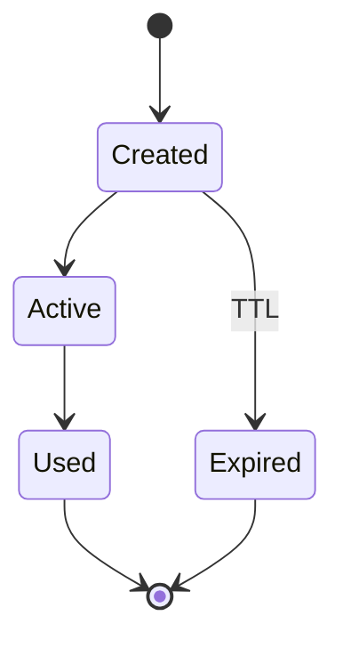
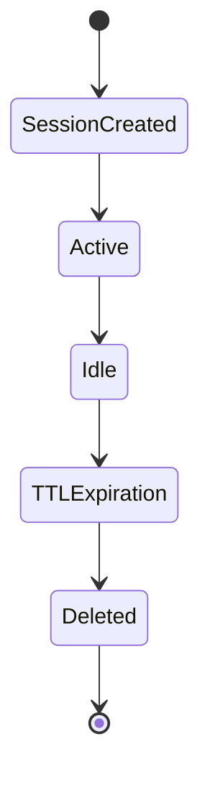

# 🧩 Data Model Design

**Author:** Muhammad Affan bin Aamir · **Version:** 1.0 · **Document:** `docs/04-data-model.md`

← [Back: Access Patterns](03-access-patterns.md) · Next: [Table Schema →](05-table-schema.md)

---

## Table of Contents

- [Purpose](#purpose)
- [Design Principles](#design-principles)
- [High-Level Data Model](#high-level-data-model)
- [Entities](#entities)
- [Item Types](#item-types)
- [Logical Relationships](#logical-relationships)
- [Lifecycles](#lifecycles)
- [Data Ownership](#data-ownership)
- [Data Consistency](#data-consistency)
- [Queue Position Strategy](#queue-position-strategy)
- [Time To Live (TTL)](#time-to-live-ttl)
- [Sharding Strategy](#sharding-strategy)
- [Aggregate Counters](#aggregate-counters)
- [Benefits of the Model](#benefits-of-the-model)
- [Future Extensions](#future-extensions)

---

## Purpose

This document defines the **logical** data model for the Football Virtual Waiting Room, built on Amazon DynamoDB's **Single Table Design** methodology — multiple related entity types stored in one table, differentiated by structured keys and item attributes.

The model is optimized directly for the access patterns identified in [`03-access-patterns.md`](03-access-patterns.md). The next document, [`05-table-schema.md`](05-table-schema.md), turns everything here into a concrete physical schema.

---

## Design Principles

- Single Table Design
- Access Pattern First
- Query Instead of Scan
- Event-Driven Architecture
- Horizontal Scalability
- Automatic Expiration
- Minimal GSIs
- Immutable Queue Entries

---

## High-Level Data Model

The application manages six logical entity types. Although they appear as separate concepts, **all six live in one DynamoDB table.**



---

## Entities

| Entity | Represents | Key Attributes | Example Key |
|---|---|---|---|
| **1. Event** | A football match | Event ID, Match Name, Stadium, Capacity, Start Time, Queue Status | `EVENT#1001` |
| **2. User** | A registered customer | User ID, Name, Email | — (global entity, may join multiple events) |
| **3. Queue Entry** | A user's position in a specific event's queue | Queue Position, Join Time, Status, Estimated Wait, Shard ID, Admission Time | `QUEUE#<position>` |
| **4. Admission Token** | Issued when a user is admitted | Token ID, User ID, Event ID, Expiration, Status | `TOKEN#<id>` |
| **5. Session** | An active waiting-room session | Session ID, Last Activity, Device ID, TTL | `SESSION#ACTIVE` |
| **6. Queue Statistics** | Aggregate counters | Users Waiting, Users Admitted, Queue Length, Average Wait Time | `STATS` |

**Queue Entry status values:** `WAITING` · `ADMITTED` · `COMPLETED` · `CANCELLED` · `EXPIRED`
**Admission Token states:** `ACTIVE` · `USED` · `EXPIRED`

---

## Item Types

Every item stored in DynamoDB belongs to exactly one logical type:

| Item Type | Purpose |
|---|---|
| `EVENT` | Football event |
| `USER` | Customer |
| `QUEUE` | Queue entry |
| `TOKEN` | Admission token |
| `SESSION` | Waiting-room session |
| `STATS` | Aggregate counters |

---

## Logical Relationships



---

## Lifecycles

### Queue Entry Lifecycle



### Admission Token Lifecycle



TTL automatically removes expired tokens — no scheduled cleanup required.

### Session Lifecycle



---

## Data Ownership

| Entity | Owner |
|---|---|
| Event | Administrator |
| User | Authentication System |
| Queue Entry | Waiting Room |
| Session | Waiting Room |
| Token | Admission Service |
| Statistics | Queue Manager |

---

## Data Consistency

| Entity / Field | Consistency Model |
|---|---|
| Queue Position | **Immutable** |
| Queue Status | Mutable |
| Token Status | Mutable |
| Session | Mutable |
| Event | Mostly Immutable |
| Statistics | Frequently Updated |

---

## Queue Position Strategy

Queue positions are assigned once, at join time, and **never modified**. Rather than shifting every user forward when someone ahead of them leaves, only the `status` field changes as a user progresses through admission.

This one decision is what keeps write volume flat even as the queue churns at scale — see the cost impact discussion in [`10-cost-estimation.md`](10-cost-estimation.md).

---

## Time To Live (TTL)

TTL is enabled for:

- Sessions
- Admission Tokens

**Benefits:** automatic cleanup, lower storage cost, zero scheduled jobs.

---

## Sharding Strategy

To avoid hot partitions when millions of users join the same event, queue entries can be distributed across logical write shards:

```
EVENT#1001#SHARD#01
EVENT#1001#SHARD#02
EVENT#1001#SHARD#03
...
EVENT#1001#SHARD#20
```

Users are assigned to a shard using a deterministic hashing strategy (for example, based on User ID).

**Benefits:** even write distribution, improved throughput, better adaptive capacity. This is a *future-ready* extension point, not required for the initial implementation — see [`05-table-schema.md#future-scalability`](05-table-schema.md#future-scalability) for how the key structure supports this without an API contract change.

---

## Aggregate Counters

Frequently requested statistics shouldn't require table scans. Instead, maintain dedicated counter items that are updated atomically:

- Users Waiting
- Users Admitted
- Users Expired
- Average Wait

---

## Benefits of the Model

- Supports millions of users
- Query-based access only
- Automatic expiration
- Efficient storage
- Minimal duplication
- High scalability
- Low operational cost

---

## Future Extensions

The model is designed to extend to:

- VIP queues
- Priority admission
- Multiple ticket categories
- Regional waiting rooms
- Dynamic queue balancing
- Fraud detection
- Multi-region deployments

---

Next: [`05-table-schema.md`](05-table-schema.md) converts these logical entities into a concrete physical schema — partition keys, sort keys, attribute naming conventions, item examples, and Global Secondary Indexes.