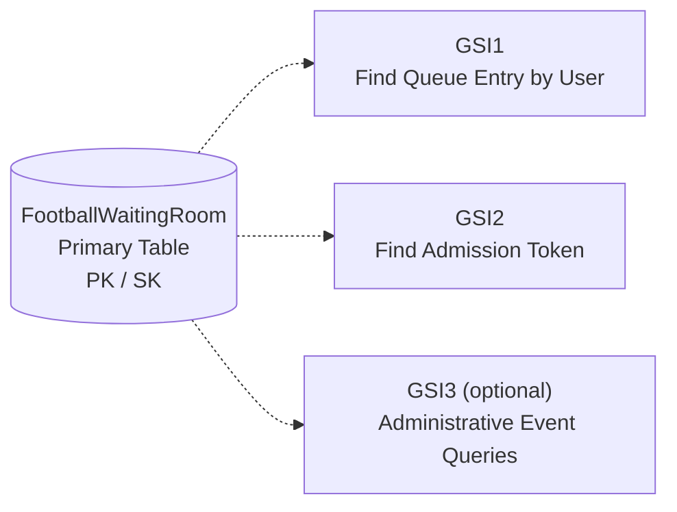

# 🔍 Global Secondary Index (GSI) Design

**Author:** Muhammad Affan bin Aamir · **Version:** 1.0 · **Document:** `docs/06-index-design.md`

← [Back: Table Schema](05-table-schema.md) · Next: [System Architecture →](07-system-architecture.md)

---

## Table of Contents

- [Purpose](#purpose)
- [Index Design Philosophy](#index-design-philosophy)
- [Overview](#overview)
- [GSI1 — User Queue Lookup](#gsi1--user-queue-lookup)
- [GSI2 — Token Lookup](#gsi2--token-lookup)
- [GSI3 — Administrative Queue View (Optional)](#gsi3--administrative-queue-view-optional)
- [Sparse Indexes](#sparse-indexes)
- [Projected Attributes](#projected-attributes)
- [Read Patterns](#read-patterns)
- [Cost Considerations](#cost-considerations)
- [Why Not More GSIs?](#why-not-more-gsis)
- [High Availability](#high-availability)
- [Future Enhancements](#future-enhancements)

---

## Purpose

The primary table schema ([`05-table-schema.md`](05-table-schema.md)) is optimized around **event-based access** — `PK = EVENT#<id>`. But some application queries need to look up data from a different angle entirely, such as by User ID or Token ID. Global Secondary Indexes enable these alternate access patterns without ever falling back to a table scan.

The design intentionally minimizes the number of GSIs, to keep storage cost, write amplification, and operational complexity low.

---

## Index Design Philosophy

> Every GSI must satisfy at least one real application access pattern. Indexes are never created for convenience.

Each additional index increases write cost, storage cost, and replication overhead — so only essential indexes make the cut. This directly continues the reasoning from [`03-access-patterns.md`](03-access-patterns.md): every index below traces back to a specific, numbered access pattern.

---

## Overview



| Index | Purpose | Serves Access Pattern |
|---|---|---|
| **GSI1** | Find Queue Entry by User | AP-02 Check Queue Status |
| **GSI2** | Find Admission Token | AP-06 Validate Token |
| **GSI3** *(optional)* | Administrative Event Queries | AP-09 Admin View / AP-10 Statistics |

---

## GSI1 — User Queue Lookup

Lets the application retrieve a user's queue entry without knowing its physical location in the base table.

**Supports:** Queue Status · Resume Session · Mobile Refresh · User Dashboard

| | |
|---|---|
| **Partition Key** | `GSI1PK = USER#<UserId>` |
| **Sort Key** | `GSI1SK = EVENT#<EventId>` |
| **Example** | `GSI1PK = USER#501`, `GSI1SK = EVENT#1001` |
| **Returns** | Queue Position, Status, Join Time, Estimated Wait, Event |
| **Query** | `Query` where `GSI1PK = USER#501` |

**Supported access patterns:** ✓ Check Queue Status · ✓ Resume Waiting Room · ✓ View Active Queues

---

## GSI2 — Token Lookup

Admission tokens must be validated before a user enters the ticket-purchasing system — and that validation has to be extremely fast.

| | |
|---|---|
| **Partition Key** | `GSI2PK = TOKEN#ABC123` |
| **Sort Key** | `GSI2SK = STATUS` |
| **Returns** | Token Status, User, Event, Expiration |
| **Query** | `GetItem` on `TOKEN#ABC123` |

**Supported access patterns:** ✓ Validate Token · ✓ Check Expiration · ✓ Detect Replay

---

## GSI3 — Administrative Queue View (Optional)

Not used by customer-facing APIs — exists purely for operations dashboards, monitoring, and analytics.

| | |
|---|---|
| **Partition Key** | `GSI3PK = EVENT#1001` |
| **Sort Key** | `STATUS#WAITING` |

```
EVENT#1001
   │
   ├── WAITING
   ├── WAITING
   ├── WAITING
   ├── WAITING
   ├── ADMITTED
   └── EXPIRED
```

**Supported queries:** Waiting Users · Admitted Users · Completed Users · Expired Users

**Benefit:** avoids filtering large datasets client-side; supports operational dashboards directly.

---

## Sparse Indexes

Some indexes only contain specific item types. GSI2, for example, contains only `TOKEN` items — non-token items simply don't populate `GSI2PK`/`GSI2SK`, so they never appear in it.

**Benefits:** smaller index, lower storage, faster queries.

---

## Projected Attributes

Only necessary attributes are projected into each index — every projected field is duplicated storage, so projections stay minimal.

| Index | Projected Fields | Reason |
|---|---|---|
| **GSI1** | Queue Position, Queue Status, Event ID, Join Time | Supports queue lookup without fetching the base item |
| **GSI2** | Status, Expiration, User ID | Enables token validation in a single request |
| **GSI3** | Queue Position, Status, User ID | Supports administrative dashboards |

---

## Read Patterns

| Operation | Index |
|---|---|
| Queue Status | GSI1 |
| Resume Session | GSI1 |
| Token Validation | GSI2 |
| Admin Dashboard | GSI3 |

---

## Cost Considerations

Each GSI duplicates its projected attributes, so cost discipline matters:

- Keep projections small
- Use sparse indexes
- Avoid unnecessary indexes
- Prefer `GetItem` where possible over `Query`

See [`13-cost-estimation.md`](13-cost-estimation.md) for the full cost model, including GSI write amplification.

---

## Why Not More GSIs?

These queries are **already** satisfiable using the primary key alone — no index needed:

- Event Details
- Queue Traversal
- Statistics
- Session Retrieval

Adding GSIs for these would increase write cost without a meaningful performance gain — a violation of the "every GSI needs a justification" rule above.

---

## High Availability

GSIs inherit DynamoDB's automatic replication, fault tolerance, and horizontal scaling. No additional infrastructure is required.

---

## Future Enhancements

If the system evolves, additional GSIs may support:

- VIP Queues
- Premium Ticket Holders
- Regional Waiting Rooms
- Multi-Event Dashboards
- Fraud Detection
- Queue History

These should only be added when justified by a new, real access pattern — never speculatively.

---

## Summary

| Index | Purpose |
|---|---|
| GSI1 | User Queue Lookup |
| GSI2 | Token Validation |
| GSI3 | Administrative Monitoring |

This index strategy satisfies every access pattern identified in [`03-access-patterns.md`](03-access-patterns.md) while minimizing write amplification and storage overhead.

Next: [`07-system-architecture.md`](07-system-architecture.md) places this table and its indexes into the full AWS request/response flow.