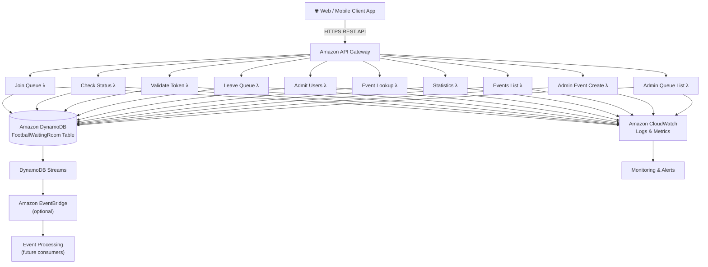
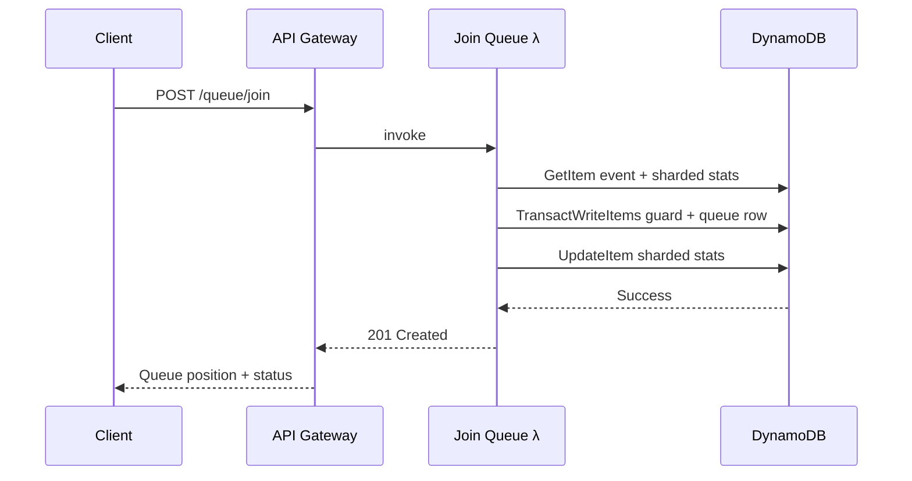
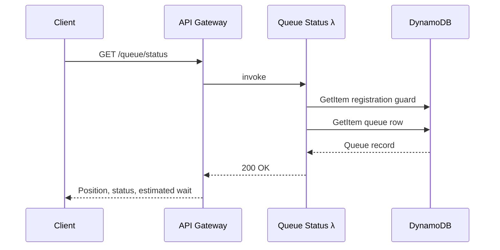
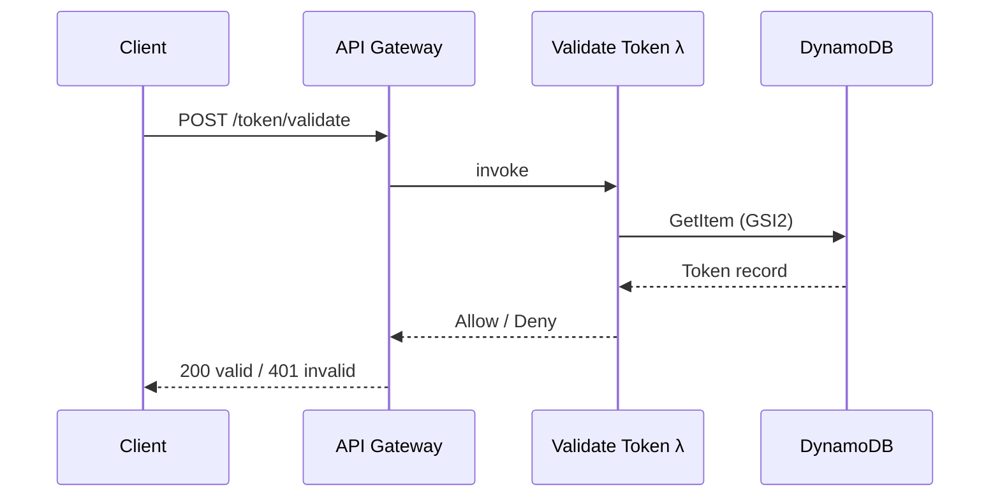
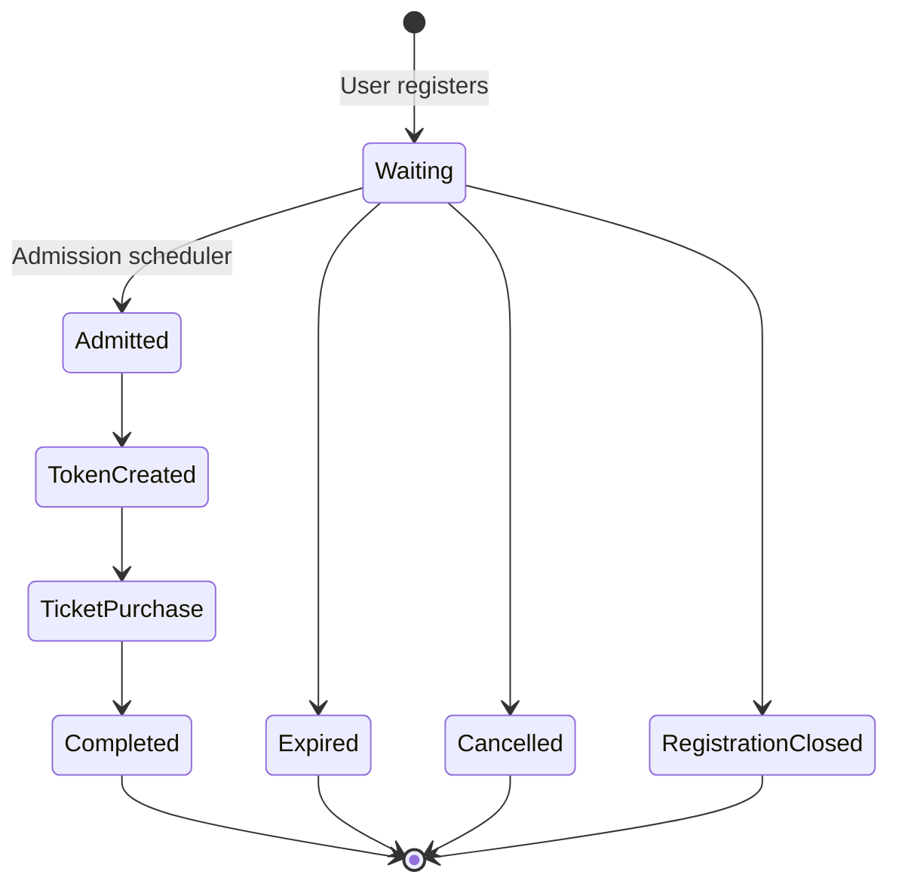

# 🏛️ System Architecture

**Author:** Muhammad Affan bin Aamir · **Version:** 1.0 · **Document:** `docs/07-system-architecture.md`

← [Back: Index Design](06-index-design.md) · Next: [API Design →](08-api-design.md)

---

## Table of Contents

- [Purpose](#purpose)
- [High-Level Architecture](#high-level-architecture)
- [AWS Services](#aws-services)
- [Architecture Principles](#architecture-principles)
- [Component Details](#component-details)
- [Request Flows](#request-flows)
- [Queue Lifecycle](#queue-lifecycle)
- [Scalability](#scalability)
- [High Availability](#high-availability)
- [Security](#security)
- [Monitoring](#monitoring)
- [Failure Handling](#failure-handling)
- [Cost Optimization](#cost-optimization)
- [Future Enhancements](#future-enhancements)

---

## Purpose

This document describes the overall architecture of the Football Virtual Waiting Room: a **serverless, event-driven architecture** built entirely on AWS managed services, prioritizing scalability, high availability, operational simplicity, and cost efficiency — with Amazon DynamoDB as the core data store.

---

## High-Level Architecture

---

## AWS Services

| Service | Purpose |
|---|---|
| Amazon API Gateway | Public REST API |
| AWS Lambda | Business logic |
| Amazon DynamoDB | Persistent storage |
| DynamoDB Streams | Change data capture / event notifications |
| Amazon CloudWatch | Logs and metrics |
| Amazon EventBridge | Event routing *(optional)* |
| AWS IAM | Authentication and authorization |

---

## Architecture Principles

- Serverless
- Event-driven
- Stateless compute
- Managed infrastructure
- Horizontal scalability
- Pay-per-use pricing

---

## Component Details

### 1. Client Application

Users interact with the waiting room through a web or mobile app, which talks **exclusively** to the REST API. Typical operations: join queue, check queue status, refresh position, enter the ticket-purchasing flow.

### 2. Amazon API Gateway

The single entry point. Responsible for HTTPS termination, request routing, authentication, rate limiting, request validation, and CORS.

| Endpoint | Purpose |
|---|---|
| `POST /queue/join` | Join the queue |
| `GET /queue/status` | Check status |
| `POST /token/validate` | Validate a token |
| `POST /queue/leave` | Leave the queue |
| `POST /queue/admit` | Admit users *(admin)* |
| `GET /queue/admin/list` | List queue rows *(admin)* |
| `GET /events` | List event catalog |
| `POST /event` | Create an event *(admin)* |
| `GET /event/{eventId}` | Event details |
| `GET /event/{eventId}/stats` | Event statistics |

*(Full endpoint list and contracts: [`08-api-design.md`](08-api-design.md).)*

### 3. AWS Lambda

Each function has exactly one responsibility:

| Function | Responsibilities |
|---|---|
| **Join Queue** | Validate request · create registration guard and queue row transactionally · assign queue position |
| **Queue Status** | Retrieve registration guard and queue row · calculate estimated wait · return current status |
| **Token Validation** | Verify token exists · check expiration · return authorization decision |
| **Queue Admission** | Select next users · update queue status · generate admission tokens (invocable on a schedule, manually, or by a future event trigger) |
| **Events List** | Return DynamoDB-backed event catalog |
| **Admin Event Create** | Create event metadata and initial stats transactionally |
| **Admin Queue List** | Return real queue rows for the admin dashboard |

### 4. Amazon DynamoDB

The primary data store: all entities, queue state, admission tokens, event metadata, and statistics.

**Features enabled:** Single Table Design · On-Demand Capacity · TTL · Streams · Point-in-Time Recovery · Server-Side Encryption. Full schema: [`05-table-schema.md`](05-table-schema.md).

### 5. DynamoDB Streams

Captures every change made to the table — useful for audit logging, metrics updates, notifications, and future integrations. Optional for the challenge scope, but enabling it demonstrates readiness for event-driven extensions.

### 6. Amazon EventBridge *(Optional)*

Can consume events from downstream processes — e.g. *user admitted*, *queue closed*, *event started*, *token expired* — decoupling future consumers from the core application.

### 7. Amazon CloudWatch

Provides logs, metrics, dashboards, and alarms. Key metrics: API latency, Lambda duration, DynamoDB throttling, error rate, admission rate.

### 8. AWS IAM

Secures inter-service communication via Lambda execution roles, DynamoDB access policies, CloudWatch permissions, and API authorization — always least privilege.

---

## Request Flows

### Join Queue

### Check Queue Status

### Validate Admission Token

---

## Queue Lifecycle

---

## Scalability

| Layer | How it scales |
|---|---|
| **API Gateway** | Scales automatically, no manual intervention |
| **AWS Lambda** | Scales automatically based on incoming request volume |
| **DynamoDB** | On-Demand capacity mode adapts automatically to changing workloads |

---

## High Availability

AWS managed services provide multi-AZ resilience, automatic failover, and durable storage — no application-managed servers required anywhere in the stack.

---

## Security

- HTTPS-only communication
- IAM least privilege, including explicit `dynamodb:TransactWriteItems` grants for transactional writers
- Admin endpoints accept demo dashboard headers (`x-admin-email`, `x-admin-password`) and still support `x-admin-api-key` as a production path
- Admin secrets are injected via Lambda environment variables from SAM parameters, not hardcoded in backend source
- Input length validation on all user-supplied fields
- batchSize capped at 500 to prevent excessive DynamoDB writes per call
- Encryption at rest (SSE enabled on DynamoDB table)
- Encryption in transit (HTTPS everywhere)
- Token expiration enforced (TTL + runtime check)
- API Gateway stage throttling (5,000 req/s rate, 2,000 burst)

---

## Monitoring

Recommended CloudWatch alarms:

| Metric | Threshold |
|---|---|
| Lambda Errors | > 1% |
| API 5XX Responses | > 0 |
| DynamoDB Throttled Requests | > 0 |
| High Latency | > 500 ms |
| Admission Failures | > 0 |

---

## Failure Handling

The application gracefully handles: duplicate registrations, invalid tokens, expired sessions, event-not-found, and capacity exhaustion. Failures return meaningful HTTP status codes and never expose internal implementation details.

---

## Cost Optimization

- Serverless services throughout — nothing runs when idle
- DynamoDB On-Demand capacity
- TTL-based automatic deletion of expired items
- No idle compute resources
- Minimal Global Secondary Indexes

Full cost model: [`10-cost-estimation.md`](10-cost-estimation.md).

---

## Future Enhancements

- Multi-region deployments
- Global Tables
- WebSocket notifications
- Priority (VIP) queues
- Fraud detection
- Analytics pipelines
- Real-time dashboards

---

## Summary

Fully serverless, horizontally scalable, and optimized around DynamoDB — demonstrating cloud-native design, event-driven processing, high availability, operational simplicity, cost efficiency, and production-ready engineering practices.

This architecture is the foundation for the API contract defined next in [`08-api-design.md`](08-api-design.md), and the infrastructure defined in `template.yaml`.
