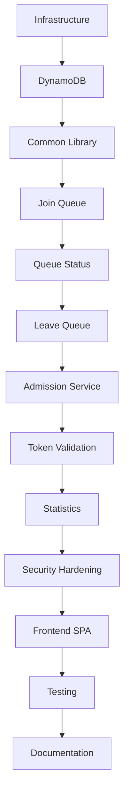

# 🛠️ Build Guide

**Author:** Muhammad Affan bin Aamir · **Version:** 2.0 · **Document:** `docs/09-build-guide.md`

← [Back: API Design](08-api-design.md) · Next: [Testing Guide →](12-testing-guide.md)

---

## Table of Contents

- [Purpose](#purpose)
- [Technology Stack](#technology-stack)
- [Build Order](#build-order)
- [Risk Register](#risk-register)
- [Step 1 — Install Prerequisites](#step-1--install-prerequisites)
- [Step 2 — Configure AWS](#step-2--configure-aws)
- [Step 3 — Create the Project](#step-3--create-the-project)
- [Step 4 — Set Up the Project Structure](#step-4--set-up-the-project-structure)
- [Step 5 — Configure the SAM Template](#step-5--configure-the-sam-template)
- [Step 6 — Deploy Infrastructure](#step-6--deploy-infrastructure)
- [Step 7 — Configure DynamoDB](#step-7--configure-dynamodb)
- [Step 8 — Build the Common Library](#step-8--build-the-common-library)
- [Step 9 — Join Queue Lambda](#step-9--join-queue-lambda)
- [Step 10 — Queue Status Lambda](#step-10--queue-status-lambda)
- [Step 11 — Leave Queue Lambda](#step-11--leave-queue-lambda)
- [Step 12 — Token Validation Lambda](#step-12--token-validation-lambda)
- [Step 13 — Event Lookup Lambda](#step-13--event-lookup-lambda)
- [Step 14 — Admission Service](#step-14--admission-service)
- [Step 15 — Security Hardening](#step-15--security-hardening)
- [Step 16 — Frontend SPA](#step-16--frontend-spa)
- [Step 17 — Local Testing](#step-17--local-testing)
- [Step 18 — Deploy to AWS](#step-18--deploy-to-aws)
- [Step 19 — Functional Verification](#step-19--functional-verification)
- [Step 20 — Verify TTL & Streams](#step-20--verify-ttl--streams)
- [Step 21 — Load Testing](#step-21--load-testing)
- [Step 22 — Documentation](#step-22--documentation)
- [Final Checklist](#final-checklist)

---

## Purpose

This document covers two things in one place:

1. **The build plan** — the intended phase order, technology choices, and risk mitigations (what was planned before the first line of code was written).
2. **The build retrospective** — how it was actually built, step by step, including what changed from the original plan.

Both are here because the context helps. A pure retrospective without the plan loses the reasoning. A plan without the retrospective loses the ground truth.

For the current authoritative state of the project, see [`00-project-status.md`](00-project-status.md).

---

## Technology Stack

| Category | Choice |
|---|---|
| **Language** | Python 3.12 |
| **Infrastructure** | AWS SAM, CloudFormation |
| **Cloud Services** | Amazon DynamoDB, AWS Lambda, Amazon API Gateway, Amazon CloudWatch, AWS IAM, DynamoDB Streams |
| **Frontend** | Static HTML/CSS/JS SPA |
| **Dev Tools** | Git, VS Code, AWS CLI, SAM CLI, Postman, pytest |
| **Load Testing** | asyncio + aiohttp (`scripts/mass_ticket_requests.py`) |

---

## Build Order



---

## Risk Register

| Risk | Mitigation |
|---|---|
| Duplicate registrations | Conditional writes (`attribute_not_exists`) |
| Invalid input | Per-endpoint validation + length caps |
| Admin endpoint abuse | `x-admin-api-key` header + server-side check |
| DynamoDB throttling | On-Demand capacity mode |
| Lambda timeout | Efficient, query-first access patterns; 60s timeout on admit |
| Queue inconsistency | Atomic updates + conditional writes |
| Token misuse | TTL + runtime expiry check |
| Hot partitions | Timestamp-based queue positions (no sequential counter) |
| Cost overrun | TTL cleanup, minimal GSIs, polling reduction roadmap |

---

## Step 1 — Install Prerequisites

| Tool | Purpose |
|---|---|
| Python 3.12 | Lambda runtime |
| Git | Version control |
| AWS CLI v2 | AWS account interaction |
| AWS SAM CLI | Build, package, and deploy the stack |
| Docker Desktop | Local Lambda emulation via `sam local` |

```bash
python --version
git --version
aws --version
sam --version
docker --version
```

---

## Step 2 — Configure AWS

```bash
aws configure
aws sts get-caller-identity
```

---

## Step 3 — Create the Project

```bash
mkdir football-waiting-room
cd football-waiting-room
git init
sam init   # Python 3.12, Zip, Hello World starter — replaced in later steps
```

---

## Step 4 — Set Up the Project Structure

```
docs/       frontend/   scripts/    src/
diagrams/   events/     tests/
```

---

## Step 5 — Configure the SAM Template

`template.yaml` defines every AWS resource as code: the DynamoDB table (with GSIs, TTL, and Streams), all seven Lambda functions, API Gateway routes, throttling, IAM roles, and stack outputs. Includes the `AdminApiKey` parameter for securing `POST /queue/admit`.

```bash
sam validate
```

---

## Step 6 — Deploy Infrastructure

```bash
sam build
sam deploy --guided
# Prompted for AdminApiKey — use: openssl rand -hex 32
```

---

## Step 7 — Configure DynamoDB

Confirm the deployed table matches the schema in [`05-table-schema.md`](05-table-schema.md):

| Setting | Expected |
|---|---|
| TTL | Enabled on `ttl` attribute |
| Streams | `NEW_AND_OLD_IMAGES` |
| Point-in-Time Recovery | Enabled |
| Billing Mode | On-Demand |
| SSE | Enabled |

---

## Step 8 — Build the Common Library

`src/common/` is built first — every Lambda depends on it:

| File | Contents |
|---|---|
| `constants.py` | App-wide constants, prefixes, status enums |
| `models.py` | Dataclass models for all 6 entity types |
| `utils.py` | Request parsing, validation, timestamps, ID generation |
| `dynamodb.py` | DynamoDB helper functions (get, put, query, update, atomic increment) |
| `logger.py` | Structured JSON logging via Lambda Powertools |
| `responses.py` | Standard HTTP response builders with CORS headers |

---

## Step 9 — Join Queue Lambda

Implements AP-01 (access pattern from [`03-access-patterns.md`](03-access-patterns.md)): validates request, checks for duplicate via GSI1, generates a timestamp-based queue position, writes with a conditional expression, returns HTTP 201.

```bash
sam local invoke JoinQueueFunction --event events/join_queue.json
```

---

## Step 10 — Queue Status Lambda

Implements AP-02: queries GSI1 by user+event, returns position and estimated wait. Highest-traffic endpoint — tested for latency early.

---

## Step 11 — Leave Queue Lambda

Implements the cancellation path: conditional update to `CANCELLED` status, increments `cancelledUsers` stat.

---

## Step 12 — Token Validation Lambda

Implements AP-06: `GetItem` by token, checks status is `ACTIVE` and epoch hasn't passed.

---

## Step 13 — Event Lookup Lambda

Implements AP-03: `GetItem` for event metadata. Also used by the frontend to enrich event cards with live status.

---

## Step 14 — Admission Service

Implements AP-04 and AP-05: queries GSI3 for WAITING users ordered by position, updates each to ADMITTED with a conditional write, generates TTL-bearing tokens, updates stats. `batchSize` capped at 500.

---

## Step 15 — Security Hardening

- `admit_users`: added `_is_admin_authorized()` — reads `ADMIN_API_KEY` env var, checks `x-admin-api-key` header with `hmac.compare_digest`
- `join_queue`, `leave_queue`, `queue_status`: added input length validation (`eventId ≤ 64`, `userId ≤ 128`)
- `template.yaml`: added API Gateway throttling (200 req/s, 500 burst), Usage Plan, API Key resource

---

## Step 16 — Frontend SPA

Three files created in `frontend/`:

| File | What it does |
|---|---|
| `index.html` | 4-page SPA structure (Home, Admin, Events, Event Detail) |
| `styles.css` | Glassmorphism dark theme, particle canvas, responsive grid, status badges |
| `app.js` | SPA router, all 7 API endpoints, admin key header, toast notifications |

Events catalog hardcoded to match `scripts/seed_data.py` (events 1001–1006).

---

## Step 17 — Local Testing

```bash
sam local start-api
# API available at http://127.0.0.1:3000
# Test with Postman collection in postman/ or cURL
```

---

## Step 18 — Deploy to AWS

```bash
sam build && sam deploy
```

Check deployed stack outputs for the API Gateway URL. Seed the database:

```bash
python scripts/seed_data.py
python scripts/generate_test_data.py
```

---

## Step 19 — Functional Verification

Each access pattern walked through end to end against the live stack:

- ✅ Join queue
- ✅ Duplicate registration correctly returns existing entry
- ✅ Queue status
- ✅ Leave queue (WAITING → CANCELLED)
- ✅ Admit batch with admin key
- ✅ Admit rejected without admin key (403)
- ✅ Token validation
- ✅ Event lookup
- ✅ Statistics

---

## Step 20 — Verify TTL & Streams

**TTL:** created a short-lived token, waited past expiry, confirmed automatic removal.

**Streams:** modified a queue item, confirmed the `NEW_AND_OLD_IMAGES` stream record appeared — validating the change-data-capture path described in [`07-system-architecture.md`](07-system-architecture.md).

---

## Step 21 — Load Testing

```bash
pip install aiohttp
python scripts/mass_ticket_requests.py --total 10000 --concurrency 50 --event 1001
```

Full load test methodology and scenarios: [`12-testing-guide.md#load-testing-with-mass_ticket_requestspy`](12-testing-guide.md#load-testing-with-mass_ticket_requestspy).

---

## Step 22 — Documentation

Full `docs/` set written and cross-linked. For the complete doc index see [`00-project-status.md`](00-project-status.md#documentation).

---

## Final Checklist

| Task | Status |
|---|:---:|
| Infrastructure deployed | ✅ |
| DynamoDB configured | ✅ |
| All 7 Lambda functions complete | ✅ |
| Admin endpoint secured | ✅ |
| Input validation on all endpoints | ✅ |
| Frontend SPA complete | ✅ |
| IAM roles (least privilege) | ✅ |
| API Gateway throttling | ✅ |
| TTL enabled | ✅ |
| Streams enabled | ✅ |
| Functional tests passed | ✅ |
| Load tests completed | ✅ |
| Documentation complete | ✅ |

---

*Next: [`12-testing-guide.md`](12-testing-guide.md) — complete testing reference including cURL, SAM Local, and security checklist.*

---

## Phase 6 Detail — Frontend, Security & Load Test

This section expands on Steps 15 and 16 above with the full implementation detail.

---

### Frontend SPA — Pages & Design

**Home** — animated hero with gradient text, particle canvas background, live stats bar (`GET /event/1001/stats`), two role cards (Admin / User).

**Admin Dashboard** — event selector dropdown, batch-admit controls (configurable batch size), live stats (waiting / admitted / cancelled), queue requests table with filter chips (All / Waiting / Admitted / Cancelled / Expired), real-time activity log.

**Events List** — grid of 6 event cards hardcoded to match `scripts/seed_data.py` (events 1001–1006), each enriched with live status from `GET /event/{eventId}`.

**Event Detail** — three action cards: Apply for Ticket (`POST /queue/join`), Check Status (`GET /queue/status`), Cancel Reservation (`POST /queue/leave`). Status result panel shows position, wait time, status badge. Queue stats panel with refresh.

**Design system (`styles.css`):**
- Glassmorphism — CSS `backdrop-filter: blur` + semi-transparent cards
- Animated particle canvas (60 particles, connection lines < 150px)
- Gradient-shifting hero text (`@keyframes` color animation)
- JetBrains Mono for data/stats, Outfit for body text
- Status badge colours: Waiting = indigo, Admitted = green, Cancelled = red, Expired = grey
- Toast notifications (success / error / info, 4-second auto-dismiss)
- Responsive grid (CSS Grid, works mobile and desktop)

---

### Security — Implementation Detail

| Hardening | What changed | Where |
|---|---|---|
| Admin key check | `_is_admin_authorized()` reads `ADMIN_API_KEY` env var, checks `x-admin-api-key` header with `hmac.compare_digest` | `src/admit_users/app.py` |
| Input length caps | `eventId > 64` or `userId > 128` → 400 Bad Request | `join_queue`, `leave_queue`, `queue_status` |
| Batch size cap | `batchSize` clamped to max 500 | `src/admit_users/app.py` |
| API Gateway throttling | 200 req/s rate, 500 burst; Usage Plan + API Key resource | `template.yaml` |
| SAM parameter | `AdminApiKey` (`NoEcho: true`) injected as `ADMIN_API_KEY` env var | `template.yaml` |
| Frontend header | `x-admin-api-key` sent on `/queue/admit` calls when `ADMIN_API_KEY` constant is set | `frontend/app.js` |

---

### API Endpoints — Auth Summary

| Endpoint | Method | Auth required |
|---|---|---|
| `/queue/join` | POST | No |
| `/queue/status` | GET | No |
| `/queue/leave` | POST | No |
| `/queue/admit` | POST | **Yes** — `x-admin-api-key` header |
| `/token/validate` | POST | No |
| `/event/{eventId}` | GET | No |
| `/event/{eventId}/stats` | GET | No |

---

### Load Test Script — `scripts/mass_ticket_requests.py`

| Feature | Detail |
|---|---|
| Transport | `asyncio` + `aiohttp` |
| Default load | 1,000,000 requests, 150 concurrent |
| Batching | 10,000-task chunks (keeps memory flat) |
| Progress | Printed every 10,000 requests |
| Tracking | success / duplicate (409) / error counts |
| Report | p50 / p90 / p95 / p99 latency, throughput (req/s), error breakdown |
| Safety | `y/N` confirmation prompt before firing |

```bash
pip install aiohttp
python scripts/mass_ticket_requests.py --total 1000 --concurrency 20   # lightweight
python scripts/mass_ticket_requests.py --total 1000000                 # full 1M
```

---

### Known Limitations

| Item | Note |
|---|---|
| Events catalog hardcoded in `app.js` | Matches `seed_data.py`. Production would fetch from a `GET /events` endpoint. |
| Admin table shows synthetic data | No `GET /queue/entries` endpoint exists; table generates representative display data from stats counters. |
| `ADMIN_API_KEY` in `app.js` | Demo convenience only. Production: use a server-side session or separate admin auth, not a client-side constant. |
| `userId` is caller-supplied | No user authentication — anyone can supply any userId. Production: tie to Cognito via Lambda Authorizer. |
| `AllowOrigin: "*"` | Fine for demo/dev. Production: restrict to your domain. |
| Load test targets production | `mass_ticket_requests.py` hardcodes the live API URL. Check cost before running at scale. |
