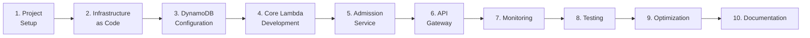
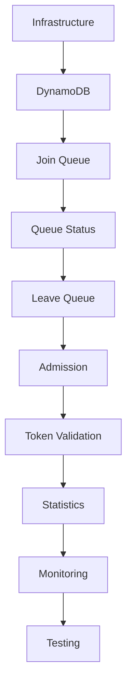
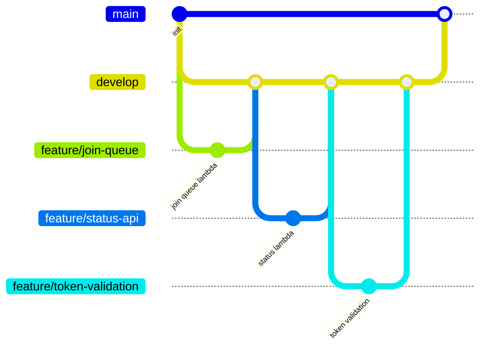

# 🗺️ Implementation Plan

**Author:** Muhammad Affan bin Aamir · **Version:** 1.0 · **Document:** `docs/09-implementation-plan.md`

← [Back: API Design](08-api-design.md) · Next: [Step-by-Step Build →](10-step-by-step-build.md)

---

> 📌 **What this document is (and isn't):** this is the **plan written before the system was built** — the intended phase order, timeline estimate, and risk register. For a live snapshot of what's actually been completed, see [`00-project-status.md`](00-project-status.md). For the retrospective account of how the build actually went, see [`10-step-by-step-build.md`](10-step-by-step-build.md). Keeping this document intact — even where reality diverged from the plan — is deliberate: it's part of the engineering record for the challenge.

---

## Table of Contents

- [Purpose](#purpose)
- [Technology Stack](#technology-stack)
- [Repository Structure](#repository-structure)
- [Development Phases](#development-phases)
- [Development Order](#development-order)
- [Milestones](#milestones)
- [Estimated Timeline](#estimated-timeline)
- [Coding Standards](#coding-standards)
- [Git Workflow](#git-workflow)
- [Risk Management](#risk-management)
- [Deliverables](#deliverables)
- [Success Criteria](#success-criteria)

---

## Purpose

This document outlines the implementation roadmap for the Football Virtual Waiting Room — divided into logical phases that gradually build the system from infrastructure provisioning through to deployment and testing. The goal: a production-quality serverless application, built following AWS best practices, not just a working prototype.

---

## Technology Stack

| Category | Choices |
|---|---|
| **Language** | Python 3.12 |
| **Infrastructure** | AWS SAM, CloudFormation |
| **Cloud Services** | Amazon DynamoDB, AWS Lambda, Amazon API Gateway, Amazon CloudWatch, AWS IAM, Amazon EventBridge *(optional)*, DynamoDB Streams |
| **Dev Tools** | Git, VS Code, AWS CLI, SAM CLI, Postman, pytest |

---

## Repository Structure

```
football-waiting-room/
├── README.md
├── template.yaml
├── samconfig.toml
├── events/
├── src/
│   ├── common/
│   │   ├── models.py
│   │   ├── constants.py
│   │   ├── dynamodb.py
│   │   ├── logger.py
│   │   ├── responses.py
│   │   └── utils.py
│   ├── join_queue/
│   ├── queue_status/
│   ├── validate_token/
│   ├── admit_users/
│   ├── leave_queue/
│   └── event_lookup/
├── tests/
├── docs/
└── scripts/
```

---

## Development Phases



| Phase | Objectives | Deliverables |
|---|---|---|
| **1. Project Setup** | Initialize repository · configure AWS CLI · install SAM CLI · create project structure · configure Git | Repository, initial commit, project skeleton |
| **2. Infrastructure as Code** | Define all AWS resources via SAM: DynamoDB table, Lambda functions, API Gateway, IAM roles, CloudWatch log groups | `template.yaml`, successful deployment |
| **3. DynamoDB Configuration** | Create table · enable TTL · enable Streams · enable Point-in-Time Recovery · configure billing mode · create GSIs | Operational DynamoDB table |
| **4. Core Lambda Development** | Implement Join Queue, Queue Status, Leave Queue, Validate Token, Event Lookup — each validating input, logging requests, handling exceptions, and returning standardized responses | 5 core Lambda functions |
| **5. Admission Service** | Retrieve waiting users · admit configurable batches · generate admission tokens · update queue status and statistics (triggerable on a schedule, manually, or by future event processing) | Admission engine |
| **6. API Gateway** | Configure REST APIs, routes, request validation, authentication, CORS, throttling for all 7 endpoints | Live REST API |
| **7. Monitoring** | Configure CloudWatch metrics (Lambda duration, errors, API latency, DynamoDB throttling, admission rate) and alarms for critical failures | Dashboards & alarms |
| **8. Testing** | Unit tests (per Lambda) → integration tests (API ↔ Lambda ↔ DynamoDB) → end-to-end tests (full user journey) → load tests (high concurrency) | Full test suite |
| **9. Optimization** | Review DynamoDB capacity, read/write efficiency, query latency, and cost; refactor where needed | Performance tuning notes |
| **10. Documentation** | Finalize architecture, API, deployment, testing, and lessons-learned docs | Complete `docs/` set |

---

## Development Order



---

## Milestones

| Milestone | Outcome |
|---|---|
| M1 | Infrastructure deployed |
| M2 | Table operational |
| M3 | Queue registration works |
| M4 | Queue lookup works |
| M5 | Admission service operational |
| M6 | Token validation complete |
| M7 | Monitoring configured |
| M8 | Load testing complete |
| M9 | Documentation complete |
| M10 | Final submission ready |

---

## Estimated Timeline

| Phase | Estimated Duration |
|---|---|
| Project Setup | 1 day |
| Infrastructure | 1 day |
| DynamoDB | 1 day |
| Lambda Development | 2 days |
| API Gateway | 1 day |
| Monitoring | 0.5 day |
| Testing | 2 days |
| Optimization | 1 day |
| Documentation | 1 day |
| **Total (estimated)** | **10–11 working days** |

---

## Coding Standards

- PEP 8
- Type hints
- Docstrings
- Structured logging
- Modular functions
- Reusable utilities

*(Enforced in practice via `CONTRIBUTING.md` and the `make lint` / `make format` tooling.)*

---

## Git Workflow



Each feature branch merges via Pull Request after tests pass — see [`CONTRIBUTING.md`](../CONTRIBUTING.md) for the full workflow and PR checklist.

---

## Risk Management

| Risk | Mitigation |
|---|---|
| Duplicate registrations | Conditional writes |
| Invalid input | API validation |
| DynamoDB throttling | On-Demand capacity |
| Lambda timeout | Efficient, query-first access patterns |
| Queue inconsistency | Atomic updates |
| Token misuse | TTL + validation |

---

## Deliverables

By the end of implementation, the repository contains:

- Infrastructure as Code
- Source Code
- Unit Tests
- Integration Tests
- Load Tests
- Documentation
- Deployment Instructions

---

## Success Criteria

The implementation is considered complete when:

- [x] All APIs function correctly
- [x] Queue registration is idempotent
- [x] Queue status is retrieved without scans
- [x] Tokens are validated correctly
- [x] Expired sessions are cleaned automatically
- [x] CloudWatch monitoring is operational
- [x] Documentation is complete
- [x] Load tests demonstrate scalability

*(For the current, authoritative status of each item, see [`00-project-status.md`](00-project-status.md).)*

---

## Summary

This plan provided the structured roadmap actually used to build the Football Virtual Waiting Room. Following it kept the system maintainable, testable, and aligned with AWS serverless best practices while satisfying the DynamoDB data-modeling objectives of the challenge.

Next: [`10-step-by-step-build.md`](10-step-by-step-build.md) walks through how the build actually went, phase by phase.