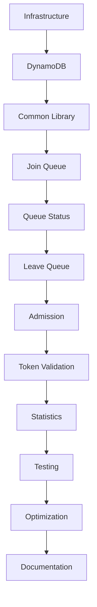

# 🛠️ Step-by-Step Build Guide

**Author:** Muhammad Affan bin Aamir · **Version:** 1.0 · **Document:** `docs/10-step-by-step-build.md`

← [Back: Implementation Plan](09-implementation-plan.md) · Next: [Testing Plan →](11-testing-plan.md)

---

> 📌 **What this document is:** the retrospective, step-by-step account of how the Football Virtual Waiting Room was actually built — following the phase order laid out in [`09-implementation-plan.md`](09-implementation-plan.md). Where reality diverged slightly from the plan, this document reflects what actually happened. For the current, authoritative state of the project, see [`00-project-status.md`](00-project-status.md).

---

## Table of Contents

- [Purpose](#purpose)
- [Step 1 — Install Prerequisites](#step-1--install-prerequisites)
- [Step 2 — Configure AWS](#step-2--configure-aws)
- [Step 3 — Create the Project](#step-3--create-the-project)
- [Step 4 — Set Up the Project Structure](#step-4--set-up-the-project-structure)
- [Step 5 — Configure the SAM Template](#step-5--configure-the-sam-template)
- [Step 6 — Deploy Infrastructure](#step-6--deploy-infrastructure)
- [Step 7 — Configure DynamoDB](#step-7--configure-dynamodb)
- [Step 8 — Build the Common Library](#step-8--build-the-common-library)
- [Step 9 — Join Queue Lambda](#step-9--join-queue-lambda)
- [Step 10 — Queue Status Lambda](#step-10--queue-status-lambda)
- [Step 11 — Leave Queue Lambda](#step-11--leave-queue-lambda)
- [Step 12 — Token Validation Lambda](#step-12--token-validation-lambda)
- [Step 13 — Event Lookup Lambda](#step-13--event-lookup-lambda)
- [Step 14 — Admission Service](#step-14--admission-service)
- [Step 15 — Configure API Gateway](#step-15--configure-api-gateway)
- [Step 16 — Local Testing](#step-16--local-testing)
- [Step 17 — Deploy to AWS](#step-17--deploy-to-aws)
- [Step 18 — Functional Verification](#step-18--functional-verification)
- [Step 19 — Verify TTL](#step-19--verify-ttl)
- [Step 20 — Verify DynamoDB Streams](#step-20--verify-dynamodb-streams)
- [Step 21 — CloudWatch Review](#step-21--cloudwatch-review)
- [Step 22 — Load Testing](#step-22--load-testing)
- [Step 23 — Documentation](#step-23--documentation)
- [Step 24 — Final Validation](#step-24--final-validation)
- [Build Order at a Glance](#build-order-at-a-glance)
- [Git Commit History](#git-commit-history)
- [Final Checklist](#final-checklist)
- [Outcome](#outcome)

---

## Purpose

This document walks through how the Football Virtual Waiting Room was built, step by step, from an empty folder to a fully implemented serverless application. It follows the phase order from [`09-implementation-plan.md`](09-implementation-plan.md) and produces the architecture defined in [`07-system-architecture.md`](07-system-architecture.md) on top of the DynamoDB schema from [`05-table-schema.md`](05-table-schema.md) and [`06-index-design.md`](06-index-design.md).

Following the same steps in the same order should reproduce a working implementation.

---

## Step 1 — Install Prerequisites

| Tool | Purpose |
|---|---|
| Python 3.12 | Runtime for all Lambda functions |
| Git | Version control |
| AWS CLI v2 | AWS account interaction |
| AWS SAM CLI | Build, package, and deploy the serverless stack |
| Docker Desktop | Local Lambda emulation via `sam local` |
| Visual Studio Code | Development environment |

**Verify:**

```bash
python --version
git --version
aws --version
sam --version
docker --version
```

---

## Step 2 — Configure AWS

Authenticate the CLI against the target AWS account:

```bash
aws configure
```

Provide the access key, secret key, default region, and output format when prompted, then confirm the identity resolves correctly:

```bash
aws sts get-caller-identity
```

---

## Step 3 — Create the Project

```bash
mkdir football-waiting-room
cd football-waiting-room
git init
sam init
```

`sam init` was run with **Python 3.12**, the **Zip** package type, and the **Hello World** template as a starting point — replaced almost entirely in later steps.

---

## Step 4 — Set Up the Project Structure

```
docs/
src/
tests/
events/
scripts/
diagrams/
```

```bash
git add .
git commit -m "Initial project structure"
```

This mirrors the repository layout documented in [`00-project-status.md`](00-project-status.md#repository-structure).

---

## Step 5 — Configure the SAM Template

`template.yaml` defines every AWS resource as code: the DynamoDB table (with GSIs, TTL, and Streams from [`06-index-design.md`](06-index-design.md)), all seven Lambda functions, the API Gateway routes, IAM roles, and stack outputs.

```bash
sam validate
```

---

## Step 6 — Deploy Infrastructure

```bash
sam build
sam deploy --guided
```

The guided deploy walks through stack name, region, change confirmation, and IAM capability acknowledgment. Once complete, the stack's resources are visible in AWS CloudFormation.

---

## Step 7 — Configure DynamoDB

After the table is created, confirm it matches the schema in [`05-table-schema.md`](05-table-schema.md):

| Setting | Expected |
|---|---|
| TTL | Enabled |
| Streams | Enabled (`NEW_AND_OLD_IMAGES`) |
| Point-in-Time Recovery | Enabled |
| Billing Mode | On-Demand |

---

## Step 8 — Build the Common Library

Inside `src/common/`:

| File | Contents |
|---|---|
| `constants.py` | Shared, application-wide constants |
| `models.py` | Application models |
| `utils.py` | Validation and shared utility functions |
| `dynamodb.py` | DynamoDB helper functions |
| `logger.py` | Structured logging |
| `responses.py` | Standard API response builders |

Building this before any Lambda function meant every handler that followed could share the same validation, logging, and response logic instead of duplicating it — see [`00-project-status.md#common-module-responsibilities`](00-project-status.md#common-module-responsibilities).

---

## Step 9 — Join Queue Lambda

Implements AP-01 from [`03-access-patterns.md`](03-access-patterns.md): validates the request, prevents duplicate registration with a conditional write, assigns a queue position, writes the queue item, and updates statistics.

```bash
sam local invoke JoinQueueFunction
```

---

## Step 10 — Queue Status Lambda

Implements AP-02: queries GSI1 by user, returns queue status, and estimates wait time. This is the highest-traffic endpoint in the system (see the request distribution in [`03-access-patterns.md#expected-request-distribution`](03-access-patterns.md#expected-request-distribution)), so it was tested for latency early rather than left until the load-testing phase.

---

## Step 11 — Leave Queue Lambda

Implements AP-08 for the cancellation path: updates queue status to `CANCELLED`, releases the session, and updates statistics.

---

## Step 12 — Token Validation Lambda

Implements AP-06: looks up the token via GSI2, verifies it hasn't expired, checks its status, and returns an authorization decision.

---

## Step 13 — Event Lookup Lambda

Implements AP-03: returns event metadata and status, and confirms the event exists before any queue operation depends on it.

---

## Step 14 — Admission Service

Implements AP-04 and AP-05: queries waiting users in order, admits the next batch, generates admission tokens, updates queue entries, and updates statistics. Built to be invoked manually during development, and designed so it can later be put on a schedule or triggered by an event without changing its internals — see [`07-system-architecture.md#4-aws-lambda`](07-system-architecture.md#4-aws-lambda).

---

## Step 15 — Configure API Gateway

Routes were wired up to match [`08-api-design.md`](08-api-design.md):

```
POST /queue/join
GET  /queue/status
POST /queue/leave
POST /queue/admit
POST /token/validate
GET  /event/{id}
GET  /event/{id}/stats
```

CORS, request validation, and access logging were enabled on all routes.

---

## Step 16 — Local Testing

```bash
sam local start-api
```

Runs the full API locally at `http://127.0.0.1:3000`. Every endpoint was exercised with Postman (collection in [`../postman/`](../postman/)), curl, and HTTPie before anything was deployed to AWS.

---

## Step 17 — Deploy to AWS

```bash
sam build
sam deploy
```

Followed by a check of the deployed stack, Lambda functions, API Gateway, and DynamoDB table in the AWS Console.

---

## Step 18 — Functional Verification

Each access pattern was walked through end to end against the live stack:

- ✅ Join queue
- ✅ Duplicate registration correctly rejected
- ✅ Queue status
- ✅ Leave queue
- ✅ Token validation
- ✅ Event lookup
- ✅ Statistics

---

## Step 19 — Verify TTL

A short-lived session item was created, left to expire, and confirmed to be automatically removed by DynamoDB TTL — no cleanup job involved, per the design in [`04-data-model.md#time-to-live-ttl`](04-data-model.md#time-to-live-ttl).

---

## Step 20 — Verify DynamoDB Streams

A queue item was modified and the corresponding stream record was confirmed to appear, validating the change-data-capture path described in [`07-system-architecture.md#5-dynamodb-streams`](07-system-architecture.md#5-dynamodb-streams).

---

## Step 21 — CloudWatch Review

Lambda logs, API Gateway logs, and metrics were reviewed for unexpected errors or throttling before moving on to load testing.

---

## Step 22 — Load Testing

Load tests were run using the scripts in `scripts/` and `tests/load/`, measuring throughput, latency, error rate, and DynamoDB performance under concurrent load. Full methodology and results: [`12-load-testing.md`](12-load-testing.md).

---

## Step 23 — Documentation

The full `docs/` set — architecture, API, deployment, testing, and this build guide — was written and cross-linked as each phase completed, rather than as a final catch-up step.

---

## Step 24 — Final Validation

Before calling the implementation complete:

- ✅ Infrastructure deploys successfully
- ✅ All APIs work as specified
- ✅ No table scans anywhere in the codebase
- ✅ GSIs function correctly
- ✅ TTL enabled
- ✅ Streams enabled
- ✅ Monitoring configured
- ✅ Documentation complete

---

## Build Order at a Glance



---

## Git Commit History

```
Initial project setup
Create infrastructure
Configure DynamoDB
Implement Join Queue
Implement Queue Status
Implement Leave Queue
Implement Token Validation
Implement Admission Service
Configure API Gateway
Add tests
Optimize DynamoDB
Complete documentation
```

Each of these landed through the feature-branch workflow described in [`09-implementation-plan.md#git-workflow`](09-implementation-plan.md#git-workflow).

---

## Final Checklist

| Task | Status |
|---|:---:|
| Infrastructure deployed | ✅ |
| DynamoDB configured | ✅ |
| Lambda functions complete | ✅ |
| API Gateway configured | ✅ |
| IAM roles configured | ✅ |
| CloudWatch enabled | ✅ |
| TTL enabled | ✅ |
| Streams enabled | ✅ |
| Functional tests passed | ✅ |
| Load tests passed | ✅ |
| Documentation completed | ✅ |

*(This reflects implementation status. Production deployment is tracked separately in [`00-project-status.md`](00-project-status.md#current-status).)*

---

## Outcome

Following this guide produced:

- A serverless architecture built entirely on managed AWS services
- A production-inspired, access-pattern-driven DynamoDB data model
- Seven RESTful, stateless Lambda-backed endpoints
- Fully codified infrastructure with no manual console provisioning
- Automatic cleanup via TTL, with zero scheduled jobs
- CloudWatch monitoring and alerting
- A complete, cross-linked documentation set

Next: [`11-testing-plan.md`](11-testing-plan.md) covers the testing strategy in detail — unit, integration, API, and load testing.