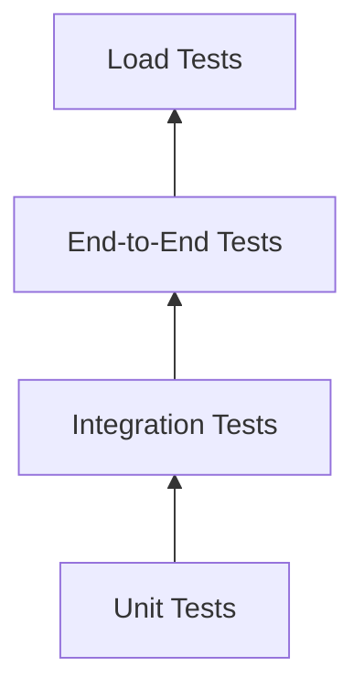
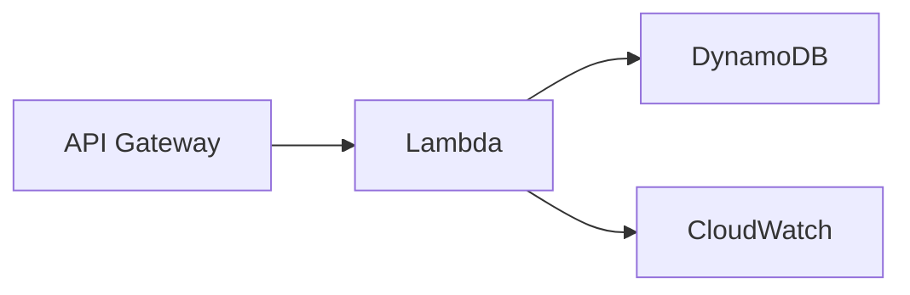

# 🧪 Testing Strategy & Validation Plan

**Author:** Muhammad Affan bin Aamir · **Version:** 1.0 · **Document:** `docs/11-testing-plan.md`

← [Back: Step-by-Step Build](10-step-by-step-build.md) · Next: [Load Testing →](12-load-testing.md)

---

## Table of Contents

- [Purpose](#purpose)
- [Testing Objectives](#testing-objectives)
- [Testing Pyramid](#testing-pyramid)
- [Test Environment](#test-environment)
- [Unit Testing](#unit-testing)
- [Integration Testing](#integration-testing)
- [API Testing](#api-testing)
- [DynamoDB Validation](#dynamodb-validation)
- [TTL Testing](#ttl-testing)
- [Streams Testing](#streams-testing)
- [Load & Stress Testing](#load--stress-testing)
- [Failure Testing](#failure-testing)
- [Security Testing](#security-testing)
- [Performance Targets](#performance-targets)
- [Observability](#observability)
- [Acceptance Criteria](#acceptance-criteria)
- [Regression Testing](#regression-testing)
- [Test Deliverables](#test-deliverables)
- [Summary](#summary)

---

## Purpose

This document defines the testing strategy for the Football Virtual Waiting Room — covering everything needed to verify that each component behaves correctly, satisfies the access patterns from [`03-access-patterns.md`](03-access-patterns.md), and holds up under high traffic without sacrificing data consistency.

The strategy spans unit testing, integration testing, API testing, DynamoDB-specific validation, load testing, failure testing, and security testing. Detailed load test scenarios and results live in the companion document, [`12-load-testing.md`](12-load-testing.md).

---

## Testing Objectives

The system should demonstrate:

- Functional correctness
- Data consistency
- High availability
- Scalability
- Fault tolerance
- Low latency
- Correct DynamoDB behavior — queries only, never scans

---

## Testing Pyramid



Most coverage sits at the unit level, where individual Lambda logic is cheap and fast to verify. Integration, end-to-end, and load tests narrow progressively, confirming the full stack behaves correctly as pieces are combined.

---

## Test Environment

| AWS Services | Testing Tools |
|---|---|
| API Gateway | pytest |
| Lambda | Postman |
| DynamoDB | AWS SAM CLI (`sam local`) |
| CloudWatch | k6 · Artillery · Locust |

---

## Unit Testing

**Objective:** verify each Lambda function in isolation, independent of the rest of the stack.

### Join Queue Lambda

| ID | Description | Expected Result |
|---|---|---|
| UT-01 | Valid registration | Queue item created |
| UT-02 | Missing Event ID | HTTP 400 |
| UT-03 | Missing User ID | HTTP 400 |
| UT-04 | Duplicate registration | HTTP 409 |
| UT-05 | Closed event | HTTP 403 |

### Queue Status Lambda

| ID | Description | Expected Result |
|---|---|---|
| UT-06 | Existing queue entry | Queue record returned |
| UT-07 | Unknown queue entry | HTTP 404 |
| UT-08 | Invalid request | HTTP 400 |

### Leave Queue Lambda

| ID | Description | Expected Result |
|---|---|---|
| UT-09 | Valid leave request | Status updated to `CANCELLED` |
| UT-10 | Already completed | HTTP 409 |
| UT-11 | Queue entry not found | HTTP 404 |

### Token Validation Lambda

| ID | Description | Expected Result |
|---|---|---|
| UT-12 | Valid token | Authorized |
| UT-13 | Expired token | Unauthorized |
| UT-14 | Unknown token | Unauthorized |
| UT-15 | Already-used token | Unauthorized |

---

## Integration Testing

**Objective:** verify that API Gateway, Lambda, DynamoDB, and CloudWatch behave correctly together — not just in isolation.



| ID | Scenario |
|---|---|
| IT-01 | Join queue, end to end |
| IT-02 | Retrieve queue status |
| IT-03 | Leave queue |
| IT-04 | Validate token |
| IT-05 | Update statistics |

---

## API Testing

Every endpoint from [`08-api-design.md`](08-api-design.md) is exercised directly:

| Endpoint | Tests |
|---|---|
| `POST /queue/join` | Success · duplicate · invalid input |
| `GET /queue/status` | Existing record · missing record |
| `POST /queue/leave` | Success · invalid |
| `POST /token/validate` | Valid · expired |
| `GET /event/{id}` | Existing · missing |
| `GET /event/{id}/stats` | Existing |

---

## DynamoDB Validation

Confirms the table behaves exactly as designed in [`05-table-schema.md`](05-table-schema.md) and [`06-index-design.md`](06-index-design.md):

- ✅ No table scans, anywhere
- ✅ Query operations only
- ✅ TTL functions as expected
- ✅ Conditional writes prevent duplicates
- ✅ GSI lookups return correct results
- ✅ Item structure matches the schema

**Access patterns verified directly:** queue lookup · event lookup · token lookup · statistics lookup.

---

## TTL Testing

1. Create a session item with a short expiration.
2. Confirm the record exists initially.
3. Wait past the expiration timestamp.
4. Confirm the record is automatically removed.
5. Confirm application logic no longer returns the expired session.

> DynamoDB TTL deletion is asynchronous — expired items may persist briefly past their expiration timestamp before background cleanup removes them. Tests account for this delay rather than asserting immediate deletion.

---

## Streams Testing

With DynamoDB Streams enabled, confirm:

- `INSERT` events fire correctly
- `MODIFY` events fire correctly
- `REMOVE` events fire correctly (including TTL-driven deletions)
- Stream records carry the expected attributes for downstream consumers

---

## Load & Stress Testing

**Load testing** simulates realistic heavy traffic:

| Scenario | Focus |
|---|---|
| 1,000 concurrent users | Baseline behavior under moderate load |
| 10,000 concurrent users | Behavior at high scale |
| Burst traffic | Sudden spikes, e.g. a ticket drop |
| Continuous polling | Queue-status traffic at realistic frequency |
| Admission batches | Behavior while users are actively being admitted |

**Metrics captured:** average latency, P95 latency, throughput, error rate, throttled requests.

**Stress testing** pushes traffic beyond expected load until the system reaches its operational limits, while observing API Gateway, Lambda concurrency, and DynamoDB behavior. The expected outcome is graceful degradation — never data corruption.

Full scenarios, tooling, and results: [`12-load-testing.md`](12-load-testing.md).

---

## Failure Testing

| Condition | Expected Behavior |
|---|---|
| Duplicate join requests | Single queue record persists |
| Invalid token | HTTP 401 |
| Closed event | Registration denied |
| Missing event | HTTP 404 |
| Queue overflow | Graceful rejection or waiting-room closure |

---

## Security Testing

- HTTPS enforced on all traffic
- Authentication required before business logic executes
- Authorization checked per request
- Input validated on every endpoint
- Token ownership verified — a token can't be validated on behalf of another user
- IAM policies follow least privilege throughout

---

## Performance Targets

| Metric | Target |
|---|---|
| API Response Time | < 200 ms (typical) |
| Lambda Duration | < 500 ms |
| Queue Registration | < 200 ms |
| Queue Lookup | < 100 ms |
| Token Validation | < 100 ms |
| Error Rate | < 1% |

These targets are validated under representative load in [`12-load-testing.md`](12-load-testing.md) and should be revisited if production requirements diverge from the assumptions in [`02-requirements-analysis.md`](02-requirements-analysis.md).

---

## Observability

Every test run confirms logs include:

- Request ID
- User ID (where applicable)
- Event ID
- Lambda execution time
- Error details — without exposing sensitive information

---

## Acceptance Criteria

The testing phase is considered complete when:

- [x] All unit tests pass
- [x] Integration tests pass
- [x] API tests pass
- [x] No table scans are required anywhere in the codebase
- [x] TTL functions correctly
- [x] GSIs satisfy every access pattern from [`03-access-patterns.md`](03-access-patterns.md)
- [x] Error handling is consistent across all endpoints
- [x] Performance targets are met, or deviations are documented
- [x] Documentation matches the implementation

---

## Regression Testing

The full test suite is re-run after:

- Schema changes
- New Lambda functions
- API modifications
- Infrastructure updates

The CI pipeline (see [`00-project-status.md#infrastructure`](00-project-status.md)) automates this on every change, rather than relying on manual re-runs.

---

## Test Deliverables

```
tests/
├── unit/
├── integration/
├── api/
├── load/
└── fixtures/
```

Supporting artifacts: test reports, load test scripts, the Postman collection in [`../postman/`](../postman/), and sample requests/responses for every endpoint.

---

## Summary

This strategy verifies correctness, scalability, and reliability across every layer of the Football Virtual Waiting Room. Combining unit, integration, API, load, and failure testing validates the DynamoDB data model under realistic conditions, not just in theory — and the results back that up in [`12-load-testing.md`](12-load-testing.md).

Next: [`12-load-testing.md`](12-load-testing.md) covers load testing methodology and results in detail.